---
## Front matter
lang: ru-RU
title: Презентация по лабораторной работе №1
subtitle: Основы информационной безопасности
author:
  - Назармамадов У. Дж.
institute:
  - Российский университет дружбы народов, Москва, Россия
date: 15 сентября 2025

## i18n babel
babel-lang: russian
babel-otherlangs: english

## Fonts
mainfont: PT Serif
romanfont: PT Serif
sansfont: PT Sans
monofont: PT Mono
mainfontoptions: Ligatures=TeX
romanfontoptions: Ligatures=TeX
sansfontoptions: Ligatures=TeX,Scale=MatchLowercase
monofontoptions: Scale=MatchLowercase,Scale=0.9

## Formatting pdf
toc: false
toc-title: Содержание
slide_level: 2
aspectratio: 169
section-titles: true
theme: metropolis
header-includes:
 - \metroset{progressbar=frametitle,sectionpage=progressbar,numbering=fraction}
 - '\makeatletter'
 - '\beamer@ignorenonframefalse'
 - '\makeatother'
---

# Информация

## Докладчик

:::::::::::::: {.columns align=center}
::: {.column width="70%"}

  * Назармамадов Умед Джамшедович
  * студент группы НКАбд-03-23
  * Российский университет дружбы народов

:::
::: {.column width="30%"}

:::
::::::::::::::

## Цель

Целью данной работы является приобретение практических навыков
установки операционной системы на виртуальную машину, настройки ми-
нимально необходимых для дальнейшей работы сервисов.

## Задание

1. Установка и настройка операционной системы.
2. Найти следующую информацию:
	1. Версия ядра Linux (Linux version).
	2. Частота процессора (Detected Mhz processor).
	3. Модель процессора (CPU0).
	4. Объем доступной оперативной памяти (Memory available).
	5. Тип обнаруженного гипервизора (Hypervisor detected).
	6. Тип файловой системы корневого раздела.

## Выполнение лабораторной работы

Создаю новую виртуальную машину в VirtualBox, выбираю имя, местоположение и образ ISO.

## Создание виртуальной машины

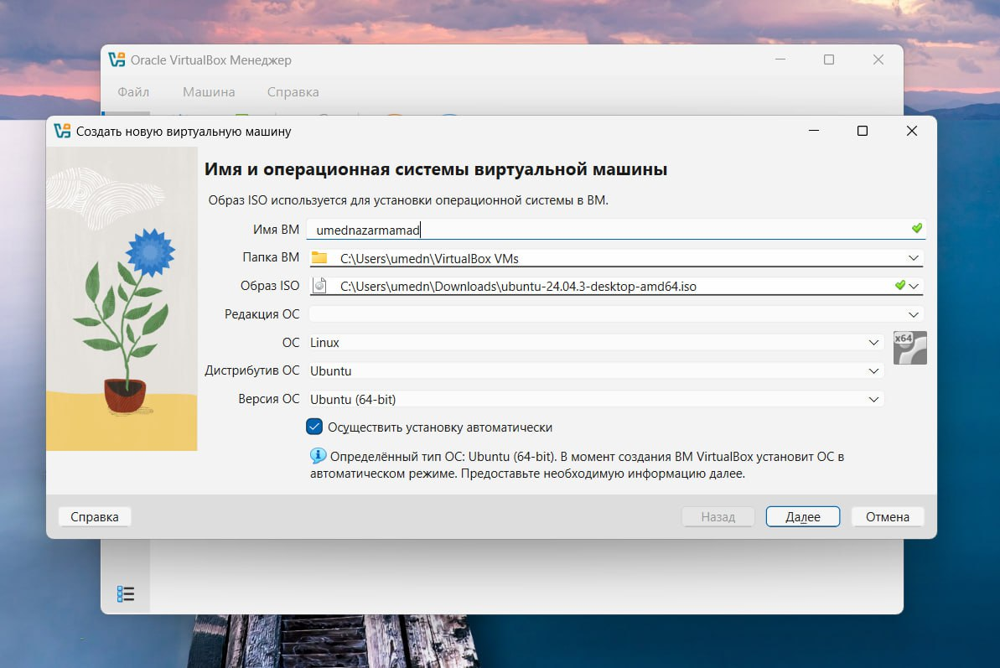{#fig:001 width=70%}

## Создание виртуальной машины

Выбираю имя пользователя и имя хоста 

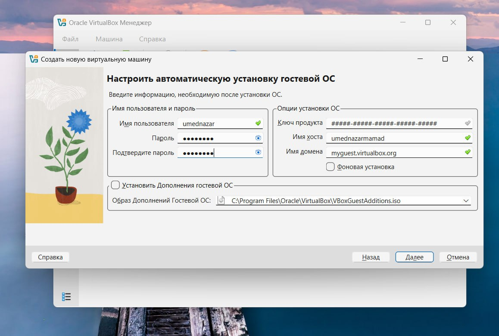{#fig:001 width=70%}

## Создание виртуальной машины

Выставляю основной памяти размер 4096 Мб, выбираю 1 процессор 

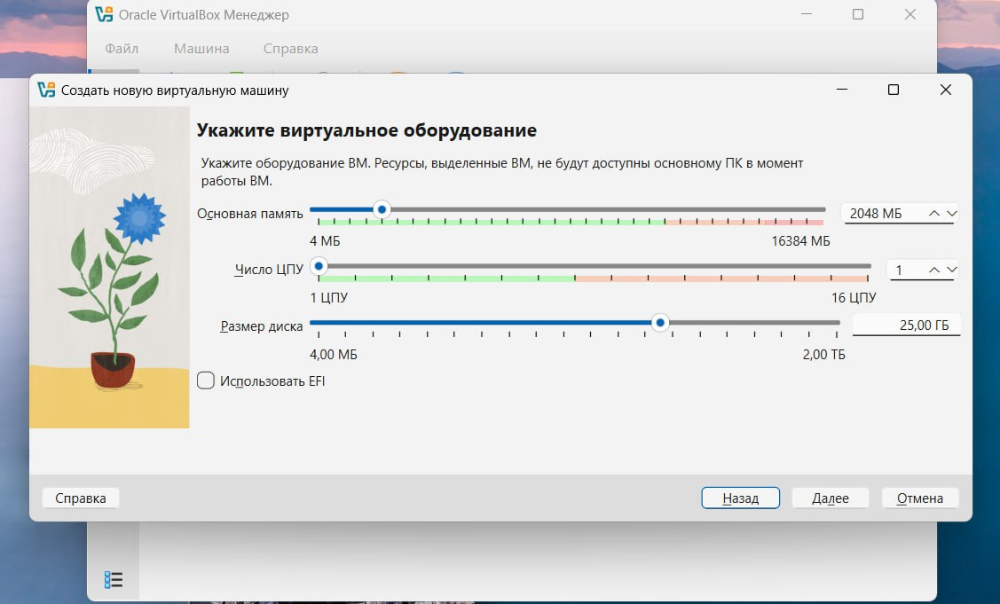{#fig:001 width=70%}

## Создание виртуальной машины

Выделяю 16 мб видеопамяти 

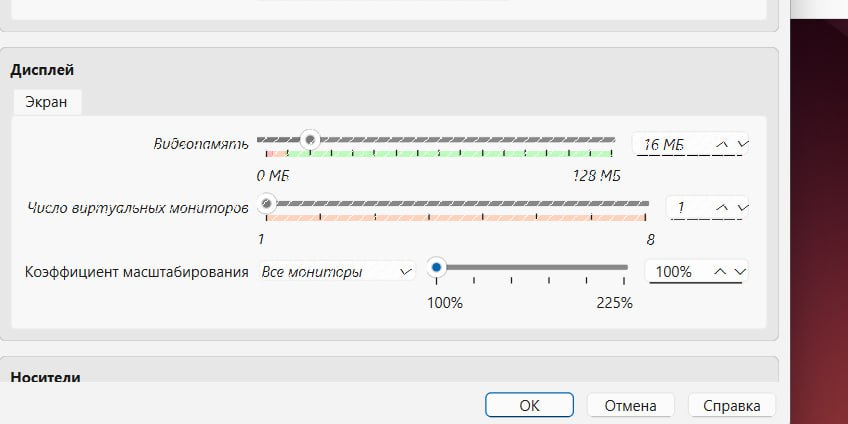{#fig:001 width=70%}

После этого запускаю операционную систему.При включении все настраиваю и начинаю работать с этой операцинной системой 
## Создание виртуальной машины

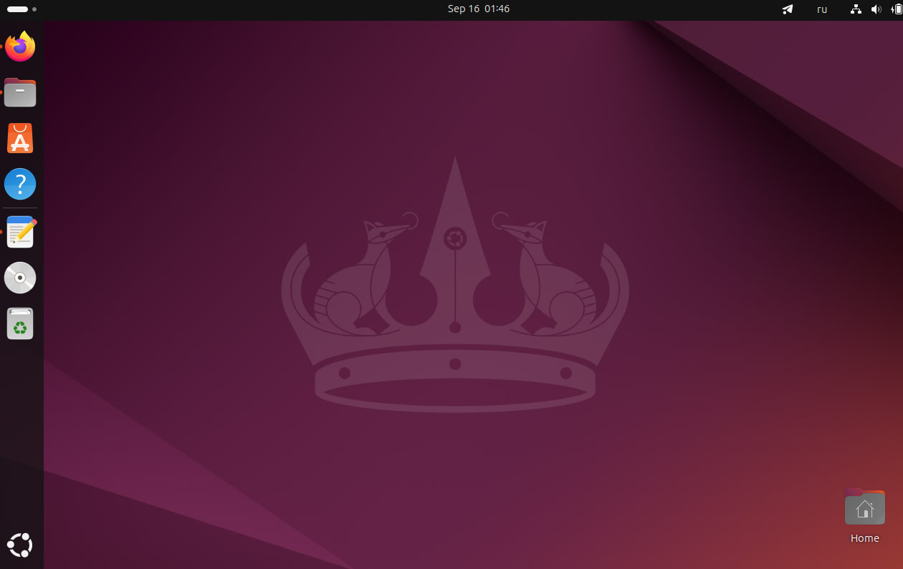{#fig:001 width=70%}

Открываю терминал, в нем прописываю dmesg | grep -i 

# Выполнение дополнительного задания

## 0

Прописиваем команду

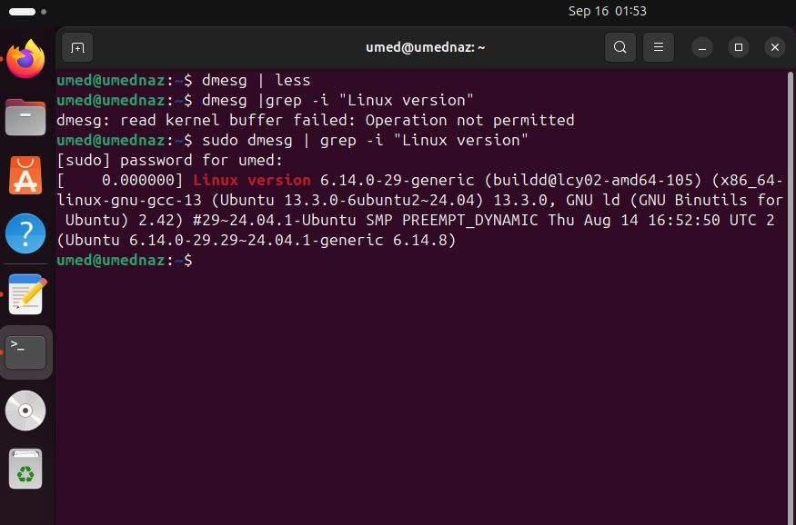{#fig:001 width=70%}

## 1

Посмотрим версию ядра 

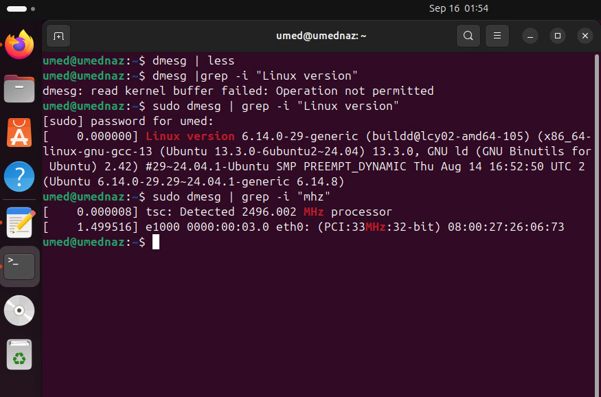{#fig:001 width=70%}

## 2

Частота процессора 

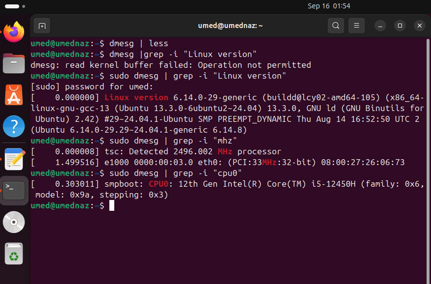{#fig:001 width=70%}

## 3

Модель процессора 

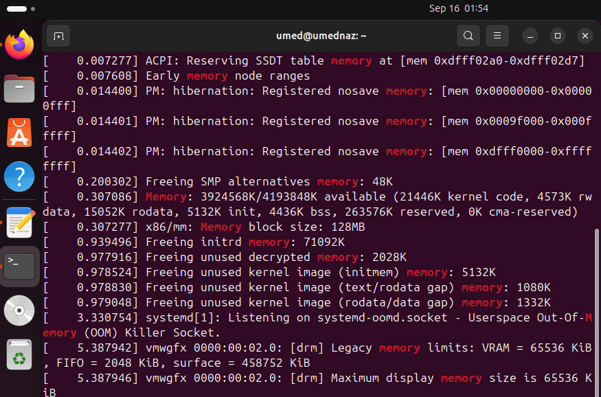{#fig:001 width=70%}

## 4

Доступно 260860 Кб из 2096696 Кб

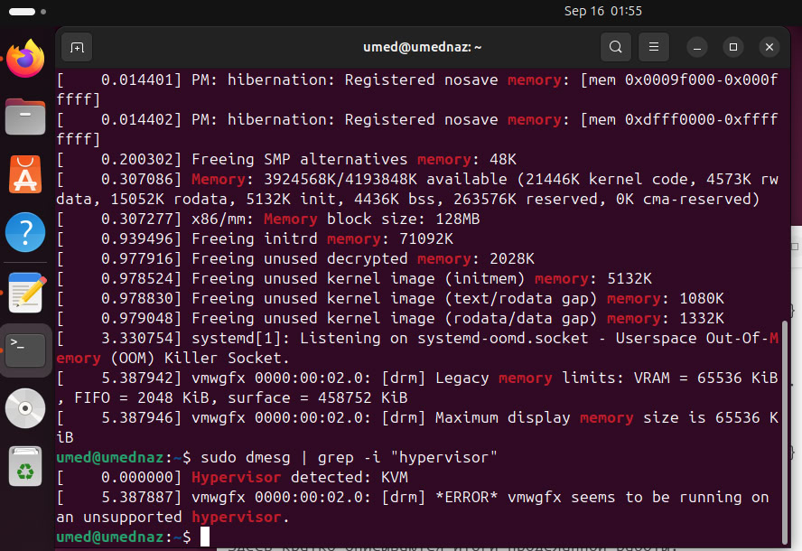{#fig:001 width=70%}

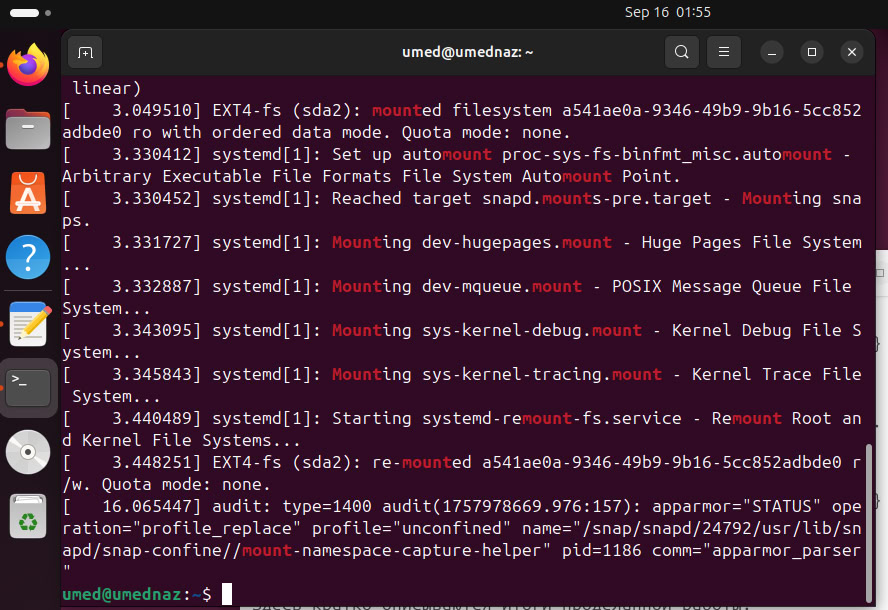{#fig:001 width=70%}

# Выводы

Приобрел практические навыки установки операционной системы на виртуальную машину, настройки минимально необходимых для дальнейшей работы сервисов.
