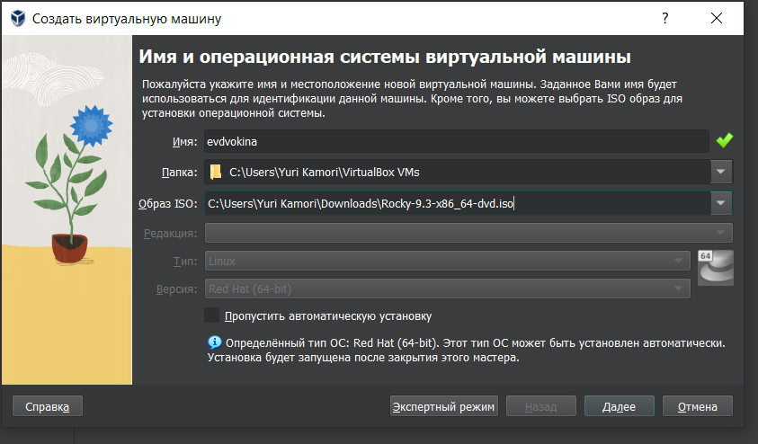
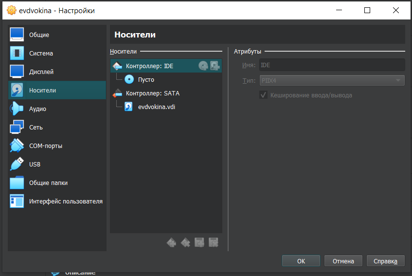
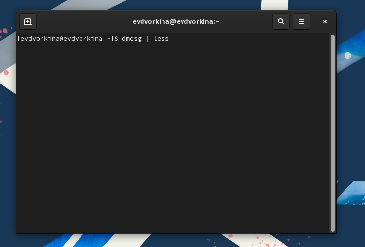
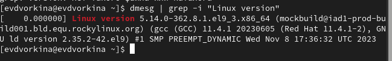
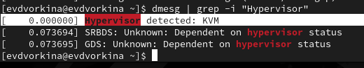

---
## Front matter
lang: ru-RU
title: Презентация по лабораторной работе №1
subtitle: Основы информационной безопасности
author:
  - Дворкина Е. В
institute:
  - Российский университет дружбы народов, Москва, Россия
date: 16 февраля 2024

## i18n babel
babel-lang: russian
babel-otherlangs: english

## Fonts
mainfont: PT Serif
romanfont: PT Serif
sansfont: PT Sans
monofont: PT Mono
mainfontoptions: Ligatures=TeX
romanfontoptions: Ligatures=TeX
sansfontoptions: Ligatures=TeX,Scale=MatchLowercase
monofontoptions: Scale=MatchLowercase,Scale=0.9

## Formatting pdf
toc: false
toc-title: Содержание
slide_level: 2
aspectratio: 169
section-titles: true
theme: metropolis
header-includes:
 - \metroset{progressbar=frametitle,sectionpage=progressbar,numbering=fraction}
 - '\makeatletter'
 - '\beamer@ignorenonframefalse'
 - '\makeatother'
---

# Информация

## Докладчик

:::::::::::::: {.columns align=center}
::: {.column width="70%"}

  * Дворкина Ева Владимировна
  * студентка группы НКАбд-01-22
  * Российский университет дружбы народов
  * <https://vk.com/yuri.kamori>

:::
::: {.column width="30%"}

:::
::::::::::::::

## Цель

Целью данной работы является приобретение практических навыков
установки операционной системы на виртуальную машину, настройки ми-
нимально необходимых для дальнейшей работы сервисов.

## Задание

1. Установка и настройка операционной системы.
2. Найти следующую информацию:
	1. Версия ядра Linux (Linux version).
	2. Частота процессора (Detected Mhz processor).
	3. Модель процессора (CPU0).
	4. Объем доступной оперативной памяти (Memory available).
	5. Тип обнаруженного гипервизора (Hypervisor detected).
	6. Тип файловой системы корневого раздела.

## Выполнение лабораторной работы

Я выполняю лабораторную работу на домашнем оборудовании, поэтому создаю новую виртуальную машину в VirtualBox, выбираю имя, местоположение  и образ ISO, устанавливать будем операционную систему Rocku DVD

{#fig:001 width=70%}

## Соглашаюсь с проставленными настройками

{#fig:005 width=70%}

## Начинается загрузка операционной системы 

{#fig:006 width=70%}

## При этом должен быть подключен в носителях образ диска!

{#fig:007 width=70%}

## Выбираю язык установки 

{#fig:008 width=70%}

## В обзоре установки будем проверять все настройки и менять на нужные 

{#fig:09 width=70%}

## Начало установки 

{#fig:017 width=70%}

## После заврешения установки образ диска сам пропадет из носителей 

{#fig:018 width=70%}

##После установки при запуске операционной системы появляется окно выбора пользователя 

{#fig:019 width=70%}

# Выполнение дополнительного задания

## 0

Открываю терминал, в нем прописываю dmesg | less 

{#fig:020 width=70%}

## 1

Версия ядра 5.14.0-362.8.1.el9_3.x86_64 

{#fig:021 width=70%}

## 2

Частота процессора 1993 МГц 

{#fig:022 width=70%}

## 3

Модель процессора Intel Core i7-8550U 

{#fig:023 width=70%}

## 4

Доступно 260860 Кб из 2096696 Кб 

{#fig:024 width=70%}

## 5

Обнаруженный гипервизор типа KVM 

{#fig:025 width=70%}

## 6

sudo fdish -l показывает тип файловой системы, типа Linux, Linux LVM 

{#fig:026 width=70%}

## 7

Далее показана последовательно монтирования файловых систем 

{#fig:027 width=70%}

## Вывод

Я приобрела практические навыки
установки операционной системы на виртуальную машину, настройки ми-
нимально необходимых для дальнейшей работы сервисов.

:::

