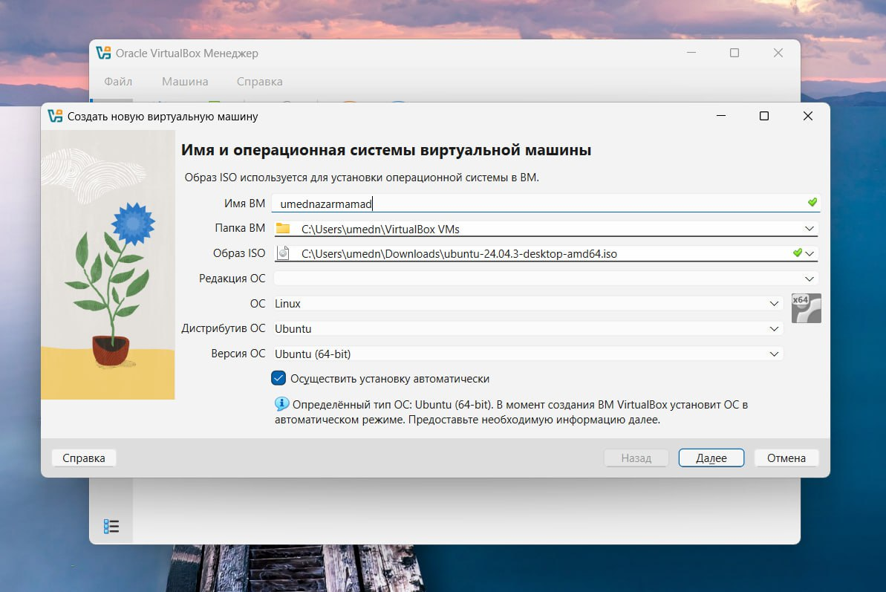
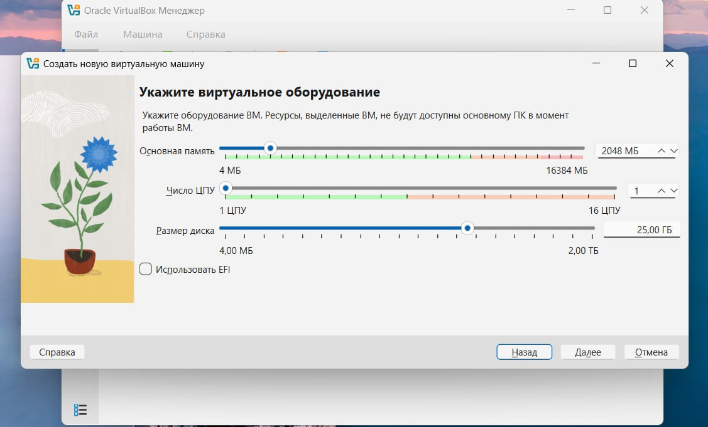
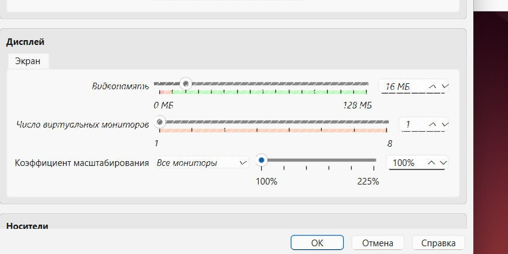
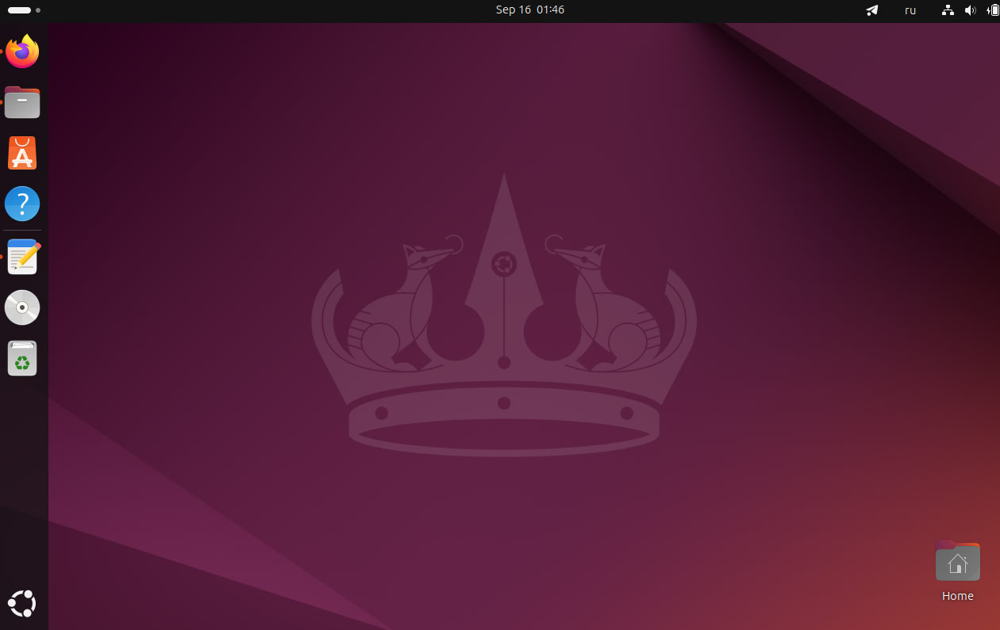
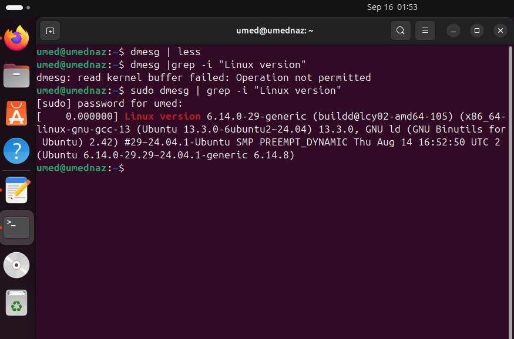
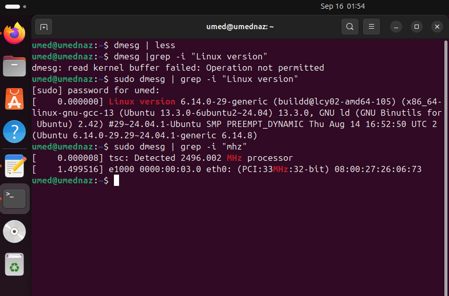
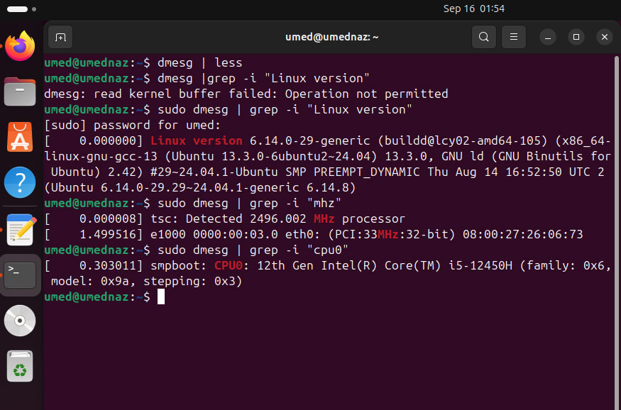
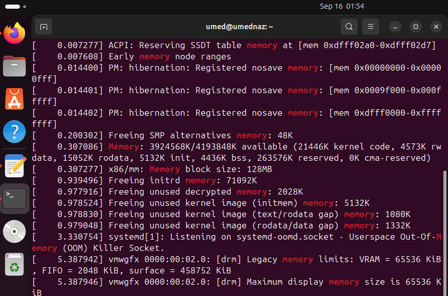
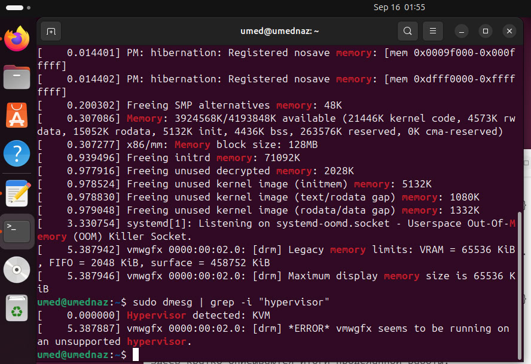
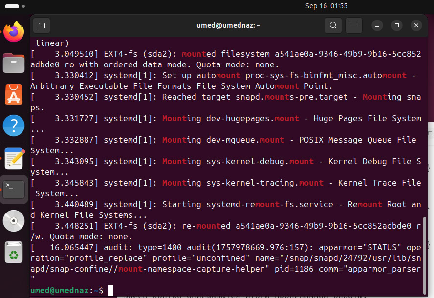

---
## Front matter
title: "Отчет по лабораторной работе №1"
subtitle: "Основы информационной безопасности"
author: "Назармамадов Умед Джамшедович"

## Generic otions
lang: ru-RU
toc-title: "Содержание"

## Bibliography
bibliography: bib/cite.bib
csl: pandoc/csl/gost-r-7-0-5-2008-numeric.csl

## Pdf output format
toc: true # Table of contents
toc-depth: 2
lof: true # List of figures
lot: true # List of tables
fontsize: 12pt
linestretch: 1.5
papersize: a4
documentclass: scrreprt
## I18n polyglossia
polyglossia-lang:
  name: russian
  options:
	- spelling=modern
	- babelshorthands=true
polyglossia-otherlangs:
  name: english
## I18n babel
babel-lang: russian
babel-otherlangs: english
## Fonts
mainfont: PT Serif
romanfont: PT Serif
sansfont: PT Sans
monofont: PT Mono
mainfontoptions: Ligatures=TeX
romanfontoptions: Ligatures=TeX
sansfontoptions: Ligatures=TeX,Scale=MatchLowercase
monofontoptions: Scale=MatchLowercase,Scale=0.9
## Biblatex
biblatex: true
biblio-style: "gost-numeric"
biblatexoptions:
  - parentracker=true
  - backend=biber
  - hyperref=auto
  - language=auto
  - autolang=other*
  - citestyle=gost-numeric
## Pandoc-crossref LaTeX customization
figureTitle: "Рис."
tableTitle: "Таблица"
listingTitle: "Листинг"
lofTitle: "Список иллюстраций"
lotTitle: "Список таблиц"
lolTitle: "Листинги"
## Misc options
indent: true
header-includes:
  - \usepackage{indentfirst}
  - \usepackage{float} # keep figures where there are in the text
  - \floatplacement{figure}{H} # keep figures where there are in the text
---

# Цель работы

Целью данной работы является приобретение практических навыков установки операционной системы на виртуальную машину, настройки ми- нимально необходимых для дальнейшей работы сервисов.

# Задание

1. Установка и настройка операционной системы.
2. Найти следующую информацию:

        1. Версия ядра Linux (Linux version).
        2. Частота процессора (Detected Mhz processor).
        3. Модель процессора (CPU0).
        4. Объем доступной оперативной памяти (Memory available).
        5. Тип обнаруженного гипервизора (Hypervisor detected).
        6. Тип файловой системы корневого раздела.

# Выполнение лабораторной работы

Создаю новую виртуальную машину в VirtualBox, выбираю имя, местоположение и образ ISO (рис. [-@fig:001]).

{#fig:001 width=70%}

Выбираю имя пользователя и имя хоста (рис. [-@fig:002]).

{#fig:001 width=70%}

Выставляю основной памяти размер 4096 Мб, выбираю 1 процессор (рис. [-@fig:003]).

{#fig:001 width=70%}

Выделяю 16 мб видеопамяти (рис. [-@fig:004]).

{#fig:001 width=70%}

После этого запускаю операционную систему.При включении все настраиваю и начинаю работать с этой операцинной системой (рис. [-@fig:005]).

{#fig:001 width=70%}

Открываю терминал, в нем прописываю dmesg | grep -i (рис. [-@fig:006]).

{#fig:001 width=70%}

Посмотрим версию ядра (рис. [-@fig:007]).

{#fig:001 width=70%}

Частота процессора (рис. [-@fig:008]).

{#fig:001 width=70%}

Модель процессора (рис. [-@fig:009]).

{#fig:001 width=70%}

Доступно 260860 Кб из 2096696 Кб (рис. [-@fig:010]).

{#fig:001 width=70%}

{#fig:001 width=70%}

# Ответы на контрольные вопросы

1. Учётная запись хранит данные для входа: имя пользователя (уникальное, латиница и «\_»), UID (уникальное число), GID (номер группы), полное имя, домашний каталог и оболочку, которая запускается при входе.

2. Основные команды Linux:

   * помощь — <команда> --help
   * переход по каталогам — cd
   * просмотр файлов — ls
   * размер каталога — du <каталог>
   * создать/удалить каталог — mkdir / rmdir
   * создать/удалить файл — touch / rm
   * права доступа — chmod
   * история команд — history

3. Файловая система — способ хранения и организации файлов.
   Примеры:

   * FAT32 — таблицы + область хранения
   * ext3/ext4 — журналируемые системы Linux.

4. Свободное место и разделы:

   * df — показывает файловые системы и их размеры
   * mount — список смонтированных устройств.

5. Удаление зависших процессов:

   * ps — посмотреть PID процесса
   * kill <PID> — завершить процесс
   * killall <имя> — завершить все процессы с этим именем.

# Выводы

Приобрел практические навыки установки операционной системы на виртуальную машину, настройки минимально необходимых для дальнейшей работы сервисов.

