---
## Front matter
lang: ru-RU
title: Презентация по лабораторной работе №2
subtitle: Основы информационной безопасности
author:
  - Назармамадов У.ДЖ.
institute:
  - Российский университет дружбы народов, Москва, Россия
date: 16 сентября 2025

## i18n babel
babel-lang: russian
babel-otherlangs: english

## Formatting pdf
toc: false
toc-title: Содержание
slide_level: 2
aspectratio: 169
section-titles: true
theme: metropolis
header-includes:
 - \metroset{progressbar=frametitle,sectionpage=progressbar,numbering=fraction}
 - '\makeatletter'
 - '\beamer@ignorenonframefalse'
 - '\makeatother'
---

# Информация

## Докладчик

:::::::::::::: {.columns align=center}
::: {.column width="70%"}

  * Назармамадов Умед Джамшедович
  * студент группы НКАбд-03-23
  * Российский университет дружбы народов

:::
::: {.column width="30%"}

:::
::::::::::::::

## Цель

Получение практических навыков работы в консоли с атрибутами файлов, закрепление теоретических основ дискреционного разграничения доступа в современных системах с открытым кодом на базе ОС Linux

## Задание

1. Работа с атрибутами файлов
2. Заполнение таблицы "Установленные права и разрешённые действия"
3. Заполнение таблицы "Минимальные права для совершения операций"

# Выполнение лабораторной работы
## 1
Создаём пользователя guest и задаём пароль (рис. [-@fig:018]).

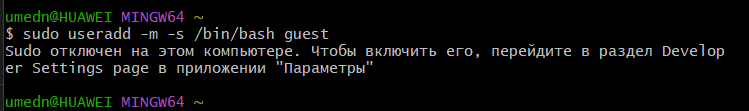{#fig:001 width=70%}

## 2
Входим под guest (рис. [-@fig:019])

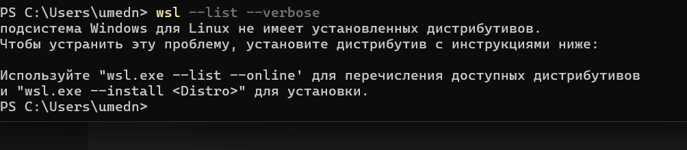{#fig:001 width=70%}

## 3
Где мы находимся и домашний каталог (рис. [-@fig:020])

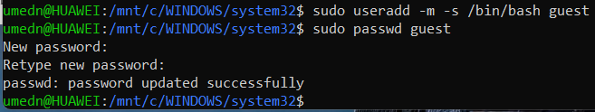{#fig:001 width=70%}

## 4
Кто мы и какие группы (рис. [-@fig:021])

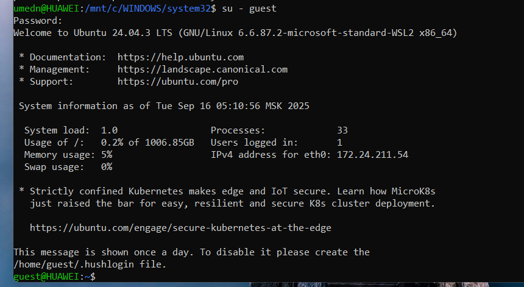{#fig:001 width=70%}

## 5
Сверяем с /etc/passwd (рис. [-@fig:022])

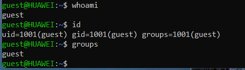{#fig:001 width=70%}

## 6
Смотрим /home и права на подкаталоги (рис. [-@fig:023])

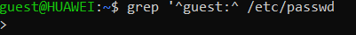{#fig:001 width=70%}

## 7
Расширенные атрибуты lsattr по /home (рис. [-@fig:024])

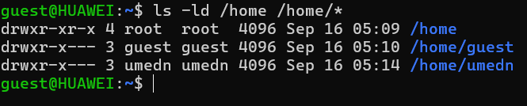{#fig:001 width=70%}

## 8
Создаём dir1 и смотрим права+атрибуты (рис. [-@fig:025])

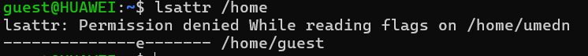{#fig:001 width=70%}

## 9
Снимаем все права с dir1 (рис. [-@fig:026])

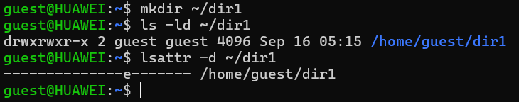{#fig:001 width=70%}

## 10
Пробуем создать файл в закрытой dir1 (рис. [-@fig:027])

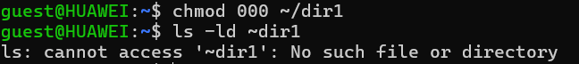{#fig:001 width=70%}

## 11
Эксперименты для Табл. 2.1 (разрешено/запрещено) (рис. [-@fig:028])

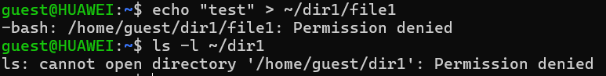{#fig:001 width=70%}

## 12
Дальше меняем права и пробуем операции. Примеры тестов (записывай в табл. «+»/«−»): (рис. [-@fig:029])

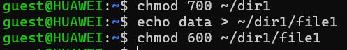{#fig:001 width=70%}

## 13
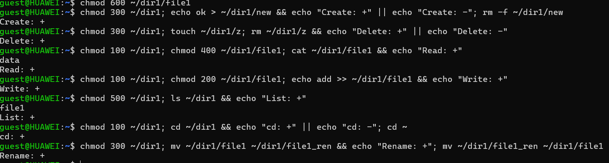{#fig:001 width=70%}

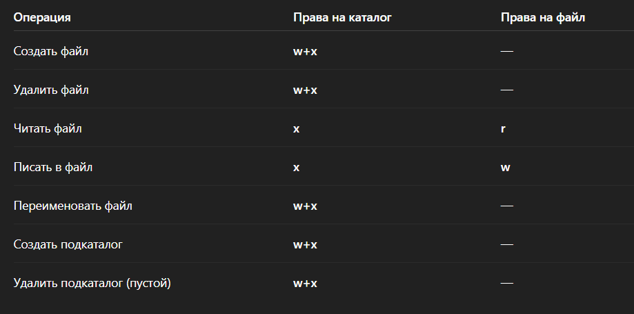{#fig:001 width=70%}

# Вывод

Были получены практические навыки работы в консоли с атрибутами файлов, закреплены теоретические основы дискреционного разграничения доступа в современных системах с открытым кодом на базе ОС Linux.
