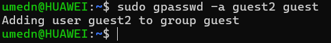
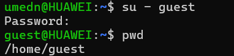
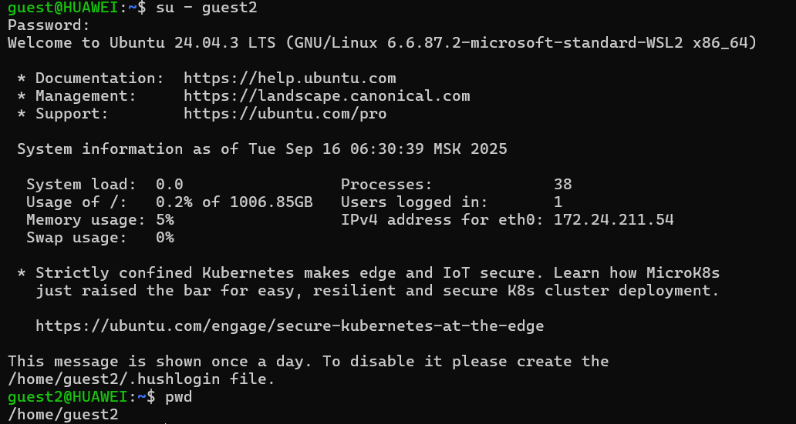
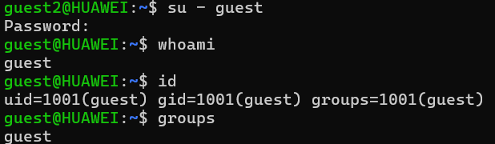
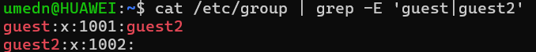
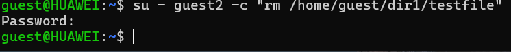
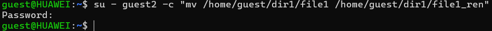

---
## Front matter
lang: ru-RU
title: Презентация по лабораторной работе №3
subtitle: Основы информационной безопасности
author:
  - Назармамадов У.ДЖ.
institute:
  - Российский университет дружбы народов, Москва, Россия
date: 16 сентября 2025

## i18n babel
babel-lang: russian
babel-otherlangs: english

## Formatting pdf
toc: false
toc-title: Содержание
slide_level: 2
aspectratio: 169
section-titles: true
theme: metropolis
header-includes:
 - \metroset{progressbar=frametitle,sectionpage=progressbar,numbering=fraction}
 - '\makeatletter'
 - '\beamer@ignorenonframefalse'
 - '\makeatother'
---

# Информация

## Докладчик

:::::::::::::: {.columns align=center}
::: {.column width="70%"}

 * Назармамадов Умед Джамшедович
  * студент группы НКАбд-03-23
  * Российский университет дружбы народов

:::
::: {.column width="30%"}

:::
::::::::::::::

# Цель

Получить практические навыки работы в консоли с атрибутами файлов для групп пользователей.

# Выполнение лабораторной работы.

## Создание пользователей

## Создание пользователей 

{#fig:001 width=70%}

## Добавляем guest2 в группу guest

{#fig:001 width=70%}

## Два пользователя на двух консолях

{#fig:001 width=70%}

## Проверка принадлежности к группам

{#fig:001 width=70%}

## Сравнение с /etc/group

{#fig:001 width=70%}

## Регистрация guest2 в группе guest

{#fig:001 width=70%}

## Меняем права домашнего каталога guest

{#fig:001 width=70%}

## Создаём dir1, снимаем права

{#fig:001 width=70%}

## Таблица 3.1 (опытные проверки). Меняем права на dir1 и file1 у guest, проверяем операции от guest2.

{#fig:001 width=70%}

## Создание файла:

{#fig:001 width=70%}

## Удаление файла:

{#fig:001 width=70%}

## Чтение файла:

{#fig:001 width=70%}

## Запись в файл:

{#fig:001 width=70%}

## Смена директории:

{#fig:001 width=70%}

## Просмотр содержимого:

{#fig:001 width=70%}

## Переименование файла:

{#fig:001 width=70%}

## Смена атрибутов файла:

{#fig:001 width=70%}

## Минимальные права (таблица 3.2)

{#fig:001 width=70%}

# Вывод

Были получены практические навыки работы в консоли с атрибутами файлов для групп пользователей

