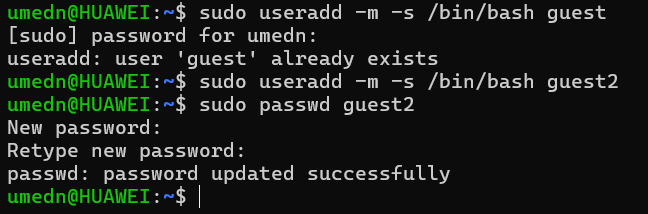
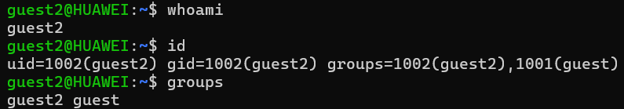
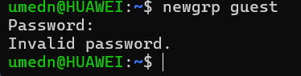
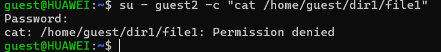
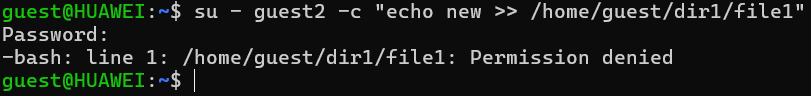
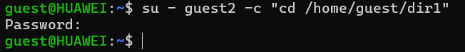
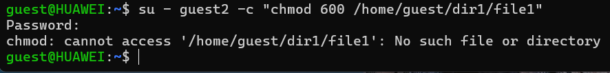
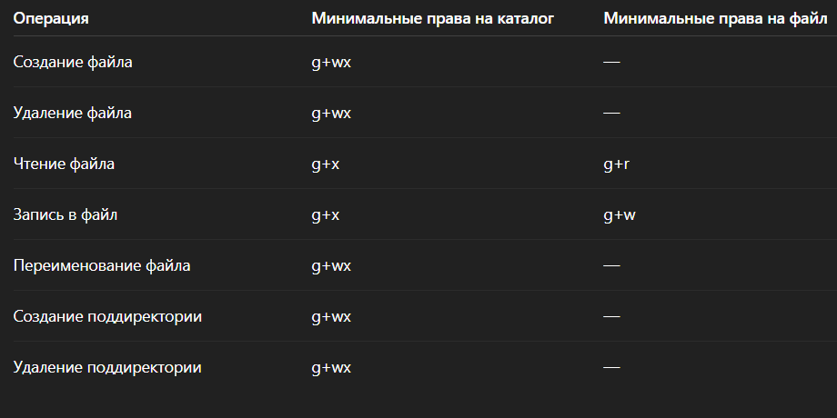

---
## Front matter
title: "Отчет по лабораторной работе №3"
subtitle: "Основы информационной безопасности"
author: "Назармамадов Умед Джамшедович"

## Generic otions
lang: ru-RU
toc-title: "Содержание"

## Bibliography
bibliography: bib/cite.bib
csl: pandoc/csl/gost-r-7-0-5-2008-numeric.csl

## Pdf output format
toc: true # Table of contents
toc-depth: 2
lof: true # List of figures
lot: true # List of tables
fontsize: 12pt
linestretch: 1.5
papersize: a4
documentclass: scrreprt
## I18n polyglossia
polyglossia-lang:
  name: russian
  options:
	- spelling=modern
	- babelshorthands=true
polyglossia-otherlangs:
  name: english
## I18n babel
babel-lang: russian
babel-otherlangs: english
## Fonts
mainfont: PT Serif
romanfont: PT Serif
sansfont: PT Sans
monofont: PT Mono
mainfontoptions: Ligatures=TeX
romanfontoptions: Ligatures=TeX
sansfontoptions: Ligatures=TeX,Scale=MatchLowercase
monofontoptions: Scale=MatchLowercase,Scale=0.9
## Biblatex
biblatex: true
biblio-style: "gost-numeric"
biblatexoptions:
  - parentracker=true
  - backend=biber
  - hyperref=auto
  - language=auto
  - autolang=other*
  - citestyle=gost-numeric
## Pandoc-crossref LaTeX customization
figureTitle: "Рис."
tableTitle: "Таблица"
listingTitle: "Листинг"
lofTitle: "Список иллюстраций"
lotTitle: "Список таблиц"
lolTitle: "Листинги"
## Misc options
indent: true
header-includes:
  - \usepackage{indentfirst}
  - \usepackage{float} # keep figures where there are in the text
  - \floatplacement{figure}{H} # keep figures where there are in the text
---

# Цель работы

Получить практические навыки работы в консоли с атрибутами файлов для групп пользователей.

# Задание

1. Создание пользователя guest2, добавление его в группу пользователей guest
2. Заполнение таблицы 3.1
3. Заполнение таблицы 3.2 на основе таблицы 3.1.

# Теоретическое введение

Права доступа определяют, какие действия конкретный пользователь может или не может совершать с определенным файлами и каталогами. С помощью разрешений можно создать надежную среду — такую, в которой никто не может поменять содержимое ваших документов или повредить системные файлы. [1]

Группы пользователей Linux кроме стандартных root и users, здесь есть еще пару десятков групп. Это группы, созданные программами, для управления доступом этих программ к общим ресурсам. Каждая группа разрешает чтение или запись определенного файла или каталога системы, тем самым регулируя полномочия пользователя, а следовательно, и процесса, запущенного от этого пользователя. Здесь можно считать, что пользователь - это одно и то же что процесс, потому что у процесса все полномочия пользователя, от которого он запущен. [2]

daemon - от имени этой группы и пользователя daemon запускаютcя сервисы, которым необходима возможность записи файлов на диск.
sys - группа открывает доступ к исходникам ядра и файлам - include сохраненным в системе
sync - позволяет выполнять команду /bin/sync
games - разрешает играм записывать свои файлы настроек и историю в определенную папку
man - позволяет добавлять страницы в директорию /var/cache/man
lp - позволяет использовать устройства параллельных портов
mail - позволяет записывать данные в почтовые ящики /var/mail/
proxy - используется прокси серверами, нет доступа записи файлов на диск
www-data - с этой группой запускается веб-сервер, она дает доступ на запись /var/www, где находятся файлы веб-документов
list - позволяет просматривать сообщения в /var/mail
nogroup - используется для процессов, которые не могут создавать файлов на жестком диске, а только читать, обычно применяется вместе с пользователем nobody.
adm - позволяет читать логи из директории /var/log
tty - все устройства /dev/vca разрешают доступ на чтение и запись пользователям из этой группы
disk - открывает доступ к жестким дискам /dev/sd* /dev/hd*, можно сказать, что это аналог рут доступа.
dialout - полный доступ к серийному порту
cdrom - доступ к CD-ROM
wheel - позволяет запускать утилиту sudo для повышения привилегий
audio - управление аудиодрайвером
src - полный доступ к исходникам в каталоге /usr/src/
shadow - разрешает чтение файла /etc/shadow
utmp - разрешает запись в файлы /var/log/utmp /var/log/wtmp
video - позволяет работать с видеодрайвером
plugdev - позволяет монтировать внешние устройства USB, CD и т д
staff - разрешает запись в папку /usr/local

# Выполнение лабораторной работы

Создание пользователей 

{#fig:001 width=70%}

Добавляем guest2 в группу guest

{#fig:001 width=70%}

Два пользователя на двух консолях

{#fig:001 width=70%}

Проверка принадлежности к группам

{#fig:001 width=70%}

Сравнение с /etc/group

{#fig:001 width=70%}

Регистрация guest2 в группе guest

{#fig:001 width=70%}

Меняем права домашнего каталога guest

{#fig:001 width=70%}

Создаём dir1, снимаем права

{#fig:001 width=70%}

Таблица 3.1 (опытные проверки). Меняем права на dir1 и file1 у guest, проверяем операции от guest2.

{#fig:001 width=70%}

Создание файла:

{#fig:001 width=70%}

Удаление файла:

{#fig:001 width=70%}

Чтение файла:

{#fig:001 width=70%}

Запись в файл:

{#fig:001 width=70%}

Смена директории:

{#fig:001 width=70%}

Просмотр содержимого:

{#fig:001 width=70%}

Переименование файла:

{#fig:001 width=70%}

Смена атрибутов файла:

{#fig:001 width=70%}

Минимальные права (таблица 3.2)

{#fig:001 width=70%}

# Выводы

Были получены практические навыки работы в консоли с атрибутами файлов для групп пользователей

# Список литературы{.unnumbered}

[0] Методические материалы курса

[1] Права доступа: https://codechick.io/tutorials/unix-linux/unix-linux-permissions

[2] Группы пользователей: https://losst.pro/gruppy-polzovatelej-linux#Что_такое_группы
