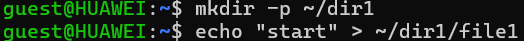
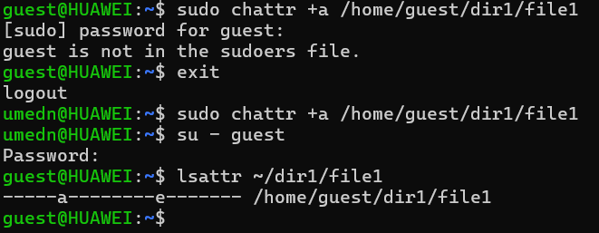

---
## Front matter
lang: ru-RU
title: Презентация по лабораторной работе №4
subtitle: Основы информационной безопасности
author:
  - Назармамадов У.ДЖ
institute:
  - Российский университет дружбы народов, Москва, Россия
date: 16 сентября 2025

## i18n babel
babel-lang: russian
babel-otherlangs: english

## Formatting pdf
toc: false
toc-title: Содержание
slide_level: 2
aspectratio: 169
section-titles: true
theme: metropolis
header-includes:
 - \metroset{progressbar=frametitle,sectionpage=progressbar,numbering=fraction}
 - '\makeatletter'
 - '\beamer@ignorenonframefalse'
 - '\makeatother'
---

# Информация

## Докладчик

:::::::::::::: {.columns align=center}
::: {.column width="70%"}

  * Назармамадов Умед Джамшедович
  * студент группы НКАбд-03-23
  * Российский университет дружбы народов

:::
::: {.column width="30%"}

:::
::::::::::::::

# Цель

Получение практических навыков работы в консоли с расширенными атрибутами файлов

# Выполнение лабораторной работы

Создал в начале тестовый файл (рис. [-@fig:001]).

{#fig:001 width=70%}

{#fig:001 width=70%}

Посмотрим расширенные атрибуты file1 (рис. [-@fig:003]).

{#fig:001 width=70%}

Выставляю обычные права (600) (рис. [-@fig:004]).

{#fig:001 width=70%}

Попытка поставить append-only атрибут a «как user» (рис. [-@fig:005]).

{#fig:001 width=70%}

Поставить a от администратора (рис. [-@fig:006]).

{#fig:001 width=70%}

Проверить, что a применился (рис. [-@fig:007]).

{#fig:001 width=70%}

Проверить дозапись и чтение (рис. [-@fig:008]).

{#fig:001 width=70%}

Убедиться, что нельзя удалять/перезаписывать/переименовывать (рис. [-@fig:009]).

{#fig:001 width=70%}

Попробовать поменять права при +a (рис. [-@fig:010]).

{#fig:001 width=70%}

Снять a и повторить «запрещённые» действия (рис. [-@fig:011]).

{#fig:001 width=70%}

Повторить опыт, но с атрибутом i (immutable) (рис. [-@fig:011]).

{#fig:001 width=70%}

{#fig:001 width=70%}

{#fig:001 width=70%}

{#fig:001 width=70%}

# Вывод

В результате выполнения работы вы повысили свои навыки использования интерфейса командой строки (CLI), познакомились на примерах с тем, как используются основные и расширенные атрибуты при разграничении доступа. Имели возможность связать теорию дискреционного разделения доступа (дискреционная политика безопасности) с её реализацией на практике в ОС Linux. Опробовали действие на практике расширенных атрибутов «а» и «i»

