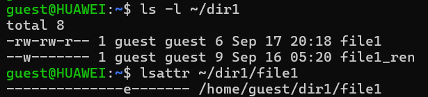
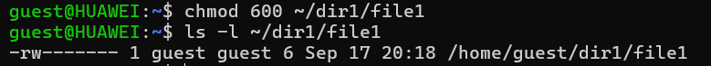
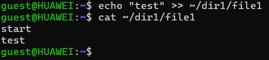
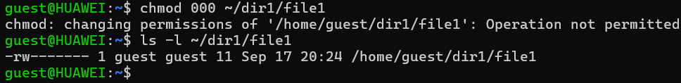
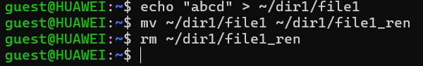
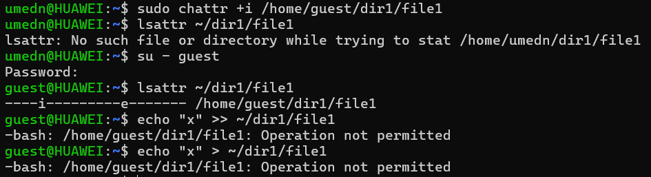
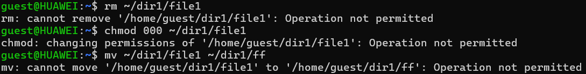
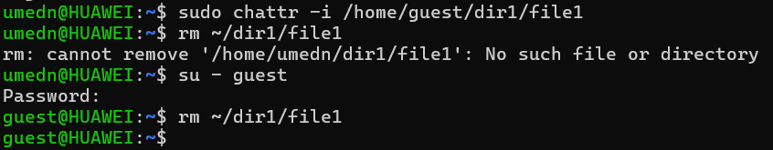

---
## Front matter
title: "Отчет по лабораторной работе №4"
subtitle: "Основы информационной безопасности"
author: "Назармамадов Умед Джамшедович"

## Generic otions
lang: ru-RU
toc-title: "Содержание"

## Bibliography
bibliography: bib/cite.bib
csl: pandoc/csl/gost-r-7-0-5-2008-numeric.csl

## Pdf output format
toc: true # Table of contents
toc-depth: 2
lof: true # List of figures
lot: true # List of tables
fontsize: 12pt
linestretch: 1.5
papersize: a4
documentclass: scrreprt
## I18n polyglossia
polyglossia-lang:
  name: russian
  options:
	- spelling=modern
	- babelshorthands=true
polyglossia-otherlangs:
  name: english
## I18n babel
babel-lang: russian
babel-otherlangs: english
## Fonts
mainfont: PT Serif
romanfont: PT Serif
sansfont: PT Sans
monofont: PT Mono
mainfontoptions: Ligatures=TeX
romanfontoptions: Ligatures=TeX
sansfontoptions: Ligatures=TeX,Scale=MatchLowercase
monofontoptions: Scale=MatchLowercase,Scale=0.9
## Biblatex
biblatex: true
biblio-style: "gost-numeric"
biblatexoptions:
  - parentracker=true
  - backend=biber
  - hyperref=auto
  - language=auto
  - autolang=other*
  - citestyle=gost-numeric
## Pandoc-crossref LaTeX customization
figureTitle: "Рис."
tableTitle: "Таблица"
listingTitle: "Листинг"
lofTitle: "Список иллюстраций"
lotTitle: "Список таблиц"
lolTitle: "Листинги"
## Misc options
indent: true
header-includes:
  - \usepackage{indentfirst}
  - \usepackage{float} # keep figures where there are in the text
  - \floatplacement{figure}{H} # keep figures where there are in the text
---

# Цель работы

Получение практических навыков работы в консоли с расширенными атрибутами файлов

# Теоретическое введение

Права доступа определяют, какие действия конкретный пользователь может или не может совершать с определенным файлами и каталогами. С помощью разрешений можно создать надежную среду — такую, в которой никто не может поменять содержимое ваших документов или повредить системные файлы. [1]

Расширенные атрибуты файлов Linux представляют собой пары имя:значение, которые постоянно связаны с файлами и каталогами, подобно тому как строки окружения связаны с процессом. Атрибут может быть определён или не определён. Если он определён, то его значение может быть или пустым, или не пустым. [2]

Расширенные атрибуты дополняют обычные атрибуты, которые связаны со всеми inode в файловой системе (т. е., данные stat(2)). Часто они используются для предоставления дополнительных возможностей файловой системы, например, дополнительные возможности безопасности, такие как списки контроля доступа (ACL), могут быть реализованы через расширенные атрибуты. [3]

Установить атрибуты:

chattr filename
Значения:

chattr +a # только добавление. Удаление и переименование запрещено;

chattr +A # не фиксировать данные об обращении к файлу

chattr +c # сжатый файл

chattr +d # неархивируемый файл

chattr +i # неизменяемый файл

chattr +S # синхронное обновление

chattr +s # безопасное удаление, (после удаления место на диске переписывается нулями)

chattr +u # неудаляемый файл

chattr -R # рекурсия

Просмотреть атрибуты:

lsattr filename
Опции:

lsattr -R # рекурсия

lsattr -a # вывести все файлы (включая скрытые)

lsattr -d # не выводить содержимое директории

# Выполнение лабораторной работы

Создал в начале тестовый файл (рис. [-@fig:001]).

{#fig:001 width=70%}

{#fig:001 width=70%}

Посмотрим расширенные атрибуты file1 (рис. [-@fig:003]).

{#fig:001 width=70%}

Выставляю обычные права (600) (рис. [-@fig:004]).

{#fig:001 width=70%}

Попытка поставить append-only атрибут a «как user» (рис. [-@fig:005]).

{#fig:001 width=70%}

Поставить a от администратора (рис. [-@fig:006]).

{#fig:001 width=70%}

Проверить, что a применился (рис. [-@fig:007]).

{#fig:001 width=70%}

Проверить дозапись и чтение (рис. [-@fig:008]).

{#fig:001 width=70%}

Убедиться, что нельзя удалять/перезаписывать/переименовывать (рис. [-@fig:009]).

{#fig:001 width=70%}

Попробовать поменять права при +a (рис. [-@fig:010]).

{#fig:001 width=70%}

Снять a и повторить «запрещённые» действия (рис. [-@fig:011]).

{#fig:001 width=70%}

Повторить опыт, но с атрибутом i (immutable) (рис. [-@fig:011]).

{#fig:001 width=70%}

{#fig:001 width=70%}

{#fig:001 width=70%}

{#fig:001 width=70%}

# Выводы

Во время выполнения работы были развиты навыки работы через интерфейс командной строки (CLI), на практике рассмотрено применение базовых и дополнительных атрибутов доступа. Теоретические основы дискреционной модели безопасности были сопоставлены с их практической реализацией в Linux. Также была проверена работа расширенных атрибутов «a» и «i», позволяющих ограничивать изменение и удаление файлов.

# Список литературы{.unnumbered}

[0] Методические материалы курса

[1] Права доступа: https://codechick.io/tutorials/unix-linux/unix-linux-permissions

[2] Расширенные атрибуты: https://ru.manpages.org/xattr/7

[3] Операции с расширенными атрибутами: https://p-n-z-8-8.livejournal.com/64493.html

::: {#refs}
:::
