---
## Front matter
title: "Отчет по лабораторной работе №5"
subtitle: "Основы информационной безопасности"
author: "Назармамадов Умед Джамшедович"

## Generic otions
lang: ru-RU
toc-title: "Содержание"

## Bibliography
bibliography: bib/cite.bib
csl: pandoc/csl/gost-r-7-0-5-2008-numeric.csl

## Pdf output format
toc: true # Table of contents
toc-depth: 2
lof: true # List of figures
lot: true # List of tables
fontsize: 12pt
linestretch: 1.5
papersize: a4
documentclass: scrreprt
## I18n polyglossia
polyglossia-lang:
  name: russian
  options:
	- spelling=modern
	- babelshorthands=true
polyglossia-otherlangs:
  name: english
## I18n babel
babel-lang: russian
babel-otherlangs: english
## Fonts
mainfont: PT Serif
romanfont: PT Serif
sansfont: PT Sans
monofont: PT Mono
mainfontoptions: Ligatures=TeX
romanfontoptions: Ligatures=TeX
sansfontoptions: Ligatures=TeX,Scale=MatchLowercase
monofontoptions: Scale=MatchLowercase,Scale=0.9
## Biblatex
biblatex: true
biblio-style: "gost-numeric"
biblatexoptions:
  - parentracker=true
  - backend=biber
  - hyperref=auto
  - language=auto
  - autolang=other*
  - citestyle=gost-numeric
## Pandoc-crossref LaTeX customization
figureTitle: "Рис."
tableTitle: "Таблица"
listingTitle: "Листинг"
lofTitle: "Список иллюстраций"
lotTitle: "Список таблиц"
lolTitle: "Листинги"
## Misc options
indent: true
header-includes:
  - \usepackage{indentfirst}
  - \usepackage{float} # keep figures where there are in the text
  - \floatplacement{figure}{H} # keep figures where there are in the text
---

# Цель работы

Изучение механизмов изменения идентификаторов, применения SetUID- и Sticky-битов. Получение практических навыков работы в кон- соли с дополнительными атрибутами. Рассмотрение работы механизма смены идентификатора процессов пользователей, а также влияние бита Sticky на запись и удаление файлов.

# Теоретическое введение

Дополнительные атрибуты файлов Linux
В Linux существует три основных вида прав — право на чтение (read), запись (write) и выполнение (execute), а также три категории пользователей, к которым они могут применяться — владелец файла (user), группа владельца (group) и все остальные (others). Но, кроме прав чтения, выполнения и записи, есть еще три дополнительных атрибута. [@u]

Sticky bit

Используется в основном для каталогов, чтобы защитить в них файлы. В такой каталог может писать любой пользователь. Но, из такой директории пользователь может удалить только те файлы, владельцем которых он является. Примером может служить директория /tmp, в которой запись открыта для всех пользователей, но нежелательно удаление чужих файлов.

SUID (Set User ID)

Атрибут исполняемого файла, позволяющий запустить его с правами владельца. В Linux приложение запускается с правами пользователя, запустившего указанное приложение. Это обеспечивает дополнительную безопасность т.к. процесс с правами пользователя не сможет получить доступ к важным системным файлам, которые принадлежат пользователю root.

SGID (Set Group ID)

Аналогичен suid, но относиться к группе. Если установить sgid для каталога, то все файлы созданные в нем, при запуске будут принимать идентификатор группы каталога, а не группы владельца, который создал файл в этом каталоге.

Обозначение атрибутов sticky, suid, sgid

Специальные права используются довольно редко, поэтому при выводе программы ls -l символ, обозначающий указанные атрибуты, закрывает символ стандартных прав доступа.

Пример: rwsrwsrwt

где первая s — это suid, вторая s — это sgid, а последняя t — это sticky bit

В приведенном примере не понятно, rwt — это rw- или rwx? Определить это просто. Если t маленькое, значит x установлен. Если T большое, значит x не установлен. То же самое правило распространяется и на s.

В числовом эквиваленте данные атрибуты определяются первым символом при четырехзначном обозначении (который часто опускается при назначении прав), например в правах 1777 — символ 1 обозначает sticky bit. Остальные атрибуты имеют следующие числовое соответствие:

1 — установлен sticky bit
2 — установлен sgid
4 — установлен suid

Компилятор GCC
GСС - это свободно доступный оптимизирующий компилятор для языков C, C++. Собственно программа gcc это некоторая надстройка над группой компиляторов, которая способна анализировать имена файлов, передаваемые ей в качестве аргументов, и определять, какие действия необходимо выполнить. Файлы с расширением .cc или .C рассматриваются, как файлы на языке C++, файлы с расширением .c как программы на языке C, а файлы c расширением .o считаются объектными.

# Выполнение лабораторной работы

обновляю пакеты и ставлю утилиту e2fsprogs (там есть chattr и lsattr) (рис. [-@fig:001]).

{#fig:001 width=70%}

захожу в домашний каталог пользователя guest, создаю каталог dir1 и файл file1.

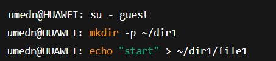{#fig:001 width=70%}

смотрю расширенные атрибуты файла.

{#fig:001 width=70%}

проверяю права доступа.

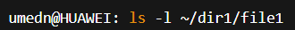{#fig:001 width=70%}

пробую поставить a (append-only) как guest. Должно выдать отказ.

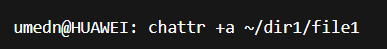{#fig:001 width=70%}

выхожу из guest и ставлю a с sudo.

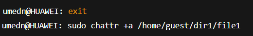{#fig:001 width=70%}

проверяю, что a появился.

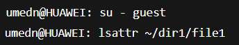{#fig:001 width=70%}

дозаписываю строку в файл (>>).

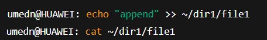{#fig:001 width=70%}

пробую перезаписать файл (>). Должно выдать отказ.

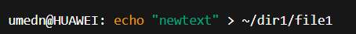{#fig:001 width=70%}

пробую удалить файл. Должно выдать отказ.

{#fig:001 width=70%}

снимаю атрибут a от root.

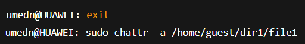{#fig:001 width=70%}

пробую снова перезаписать и удалить. Теперь должно работать.

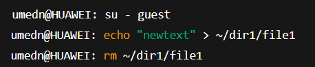{#fig:001 width=70%}

создаю заново файл и ставлю i.

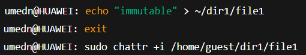{#fig:001 width=70%}

проверяю атрибуты

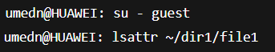{#fig:001 width=70%}

пробую дозапись, перезапись, chmod, rename и удаление. Всё должно запрещаться.

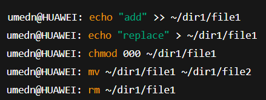{#fig:001 width=70%}

снимаю i от root и удаляю файл.

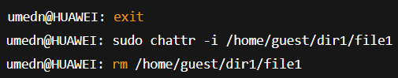{#fig:001 width=70%}

# Выводы

В ходе работы было изучено, как изменяются идентификаторы пользователей и процессов, а также применены SetUID- и Sticky-биты. Получены практические навыки работы в консоли с дополнительными атрибутами. Рассмотрено действие механизма смены идентификаторов процессов, а также влияние Sticky-бита на операции записи и удаления файлов.

# Список литературы{.unnumbered}

::: {#refs}
:::
