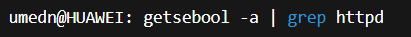
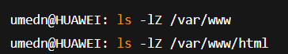
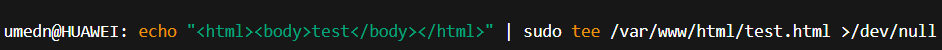
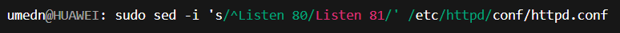

---
## Front matter
lang: ru-RU
title: Презентация по лабораторной работе №5
subtitle: Основы информационной безопасности
author:
  - Назармамадов У.ДЖ
institute:
  - Российский университет дружбы народов, Москва, Россия
date: 16 сентября 2025

## i18n babel
babel-lang: russian
babel-otherlangs: english

## Formatting pdf
toc: false
toc-title: Содержание
slide_level: 2
aspectratio: 169
section-titles: true
theme: metropolis
header-includes:
 - \metroset{progressbar=frametitle,sectionpage=progressbar,numbering=fraction}
 - \makeatletter\beamer@ignorenonframefalse\makeatother
---

# Информация

## Докладчик

:::::::::::::: {.columns align=center}
::: {.column width="70%"}

  * Назармамадов Умед Джамшедович
  * студент группы НКАбд-03-23
  * Российский университет дружбы народов

:::
::: {.column width="30%"}

:::
::::::::::::::

# Цель работы

Изучение механизмов изменения идентификаторов, применения SetUID- и Sticky-битов. Получение практических навыков работы в кон- соли с дополнительными атрибутами. Рассмотрение работы механизма смены идентификатора процессов пользователей, а также влияние бита Sticky на запись и удаление файлов.

# Выполнение лабораторной работы

обновляю пакеты и ставлю утилиту e2fsprogs (там есть chattr и lsattr) (рис. [-@fig:001]).

{#fig:001 width=70%}

захожу в домашний каталог пользователя guest, создаю каталог dir1 и файл file1.

{#fig:001 width=70%}

смотрю расширенные атрибуты файла.

{#fig:001 width=70%}

проверяю права доступа.

{#fig:001 width=70%}

пробую поставить a (append-only) как guest. Должно выдать отказ.

{#fig:001 width=70%}

выхожу из guest и ставлю a с sudo.

{#fig:001 width=70%}

проверяю, что a появился.

{#fig:001 width=70%}

дозаписываю строку в файл (>>).

{#fig:001 width=70%}

пробую перезаписать файл (>). Должно выдать отказ.

{#fig:001 width=70%}

пробую удалить файл. Должно выдать отказ.

{#fig:001 width=70%}

снимаю атрибут a от root.

{#fig:001 width=70%}

пробую снова перезаписать и удалить. Теперь должно работать.

{#fig:001 width=70%}

создаю заново файл и ставлю i.

{#fig:001 width=70%}

проверяю атрибуты

{#fig:001 width=70%}

пробую дозапись, перезапись, chmod, rename и удаление. Всё должно запрещаться.

{#fig:001 width=70%}

снимаю i от root и удаляю файл.

{#fig:001 width=70%}

# Выводы

В ходе работы было изучено, как изменяются идентификаторы пользователей и процессов, а также применены SetUID- и Sticky-биты. Получены практические навыки работы в консоли с дополнительными атрибутами. Рассмотрено действие механизма смены идентификаторов процессов, а также влияние Sticky-бита на операции записи и удаления файлов.

- Менее оптимально представить в виде рисунка, графика, таблицы
- Текст используется, если все предыдущие способы отображения информации не подошли

