---
## Front matter
title: "Отчет по лабораторной работе №6"
subtitle: "Основы информационной безопасности"
author: "Назармамадов Умед Джамшедович"

## Generic otions
lang: ru-RU
toc-title: "Содержание"

## Bibliography
bibliography: bib/cite.bib
csl: pandoc/csl/gost-r-7-0-5-2008-numeric.csl

## Pdf output format
toc: true # Table of contents
toc-depth: 2
lof: true # List of figures
lot: true # List of tables
fontsize: 12pt
linestretch: 1.5
papersize: a4
documentclass: scrreprt
## I18n polyglossia
polyglossia-lang:
  name: russian
  options:
	- spelling=modern
	- babelshorthands=true
polyglossia-otherlangs:
  name: english
## I18n babel
babel-lang: russian
babel-otherlangs: english
## Fonts
mainfont: PT Serif
romanfont: PT Serif
sansfont: PT Sans
monofont: PT Mono
mainfontoptions: Ligatures=TeX
romanfontoptions: Ligatures=TeX
sansfontoptions: Ligatures=TeX,Scale=MatchLowercase
monofontoptions: Scale=MatchLowercase,Scale=0.9
## Biblatex
biblatex: true
biblio-style: "gost-numeric"
biblatexoptions:
  - parentracker=true
  - backend=biber
  - hyperref=auto
  - language=auto
  - autolang=other*
  - citestyle=gost-numeric
## Pandoc-crossref LaTeX customization
figureTitle: "Рис."
tableTitle: "Таблица"
listingTitle: "Листинг"
lofTitle: "Список иллюстраций"
lotTitle: "Список таблиц"
lolTitle: "Листинги"
## Misc options
indent: true
header-includes:
  - \usepackage{indentfirst}
  - \usepackage{float} # keep figures where there are in the text
  - \floatplacement{figure}{H} # keep figures where there are in the text
---

# Цель работы

Развить навыки администрирования ОС Linux. Получить первое практическое знакомство с технологией SELinux1. Проверить работу SELinx на практике совместно с веб-сервером Apache.

# Теоретическое введение

SELinux (Security-Enhanced Linux) обеспечивает усиление защиты путем внесения изменений как на уровне ядра, так и на уровне пространства пользователя, что превращает ее в действительно «непробиваемую» операционную систему. Впервые эта система появилась в четвертой версии CentOS, а в 5 и 6 версии реализация была существенно дополнена и улучшена.
SELinux имеет три основных режим работы:

Enforcing: режим по умолчанию. При выборе этого режима все действия, которые каким-то образом нарушают текущую политику безопасности, будут блокироваться, а попытка нарушения будет зафиксирована в журнале.

Permissive: в случае использования этого режима, информация о всех действиях, которые нарушают текущую политику безопасности, будут зафиксированы в журнале, но сами действия не будут заблокированы.

Disabled: полное отключение системы принудительного контроля доступа.

Политика SELinux определяет доступ пользователей к ролям, доступ ролей к доменам и доступ доменов к типам. Контекст безопасности — все атрибуты SELinux — роли, типы и домены. Более подробно см. в [@f].

Apache — это свободное программное обеспечение, с помощью которого можно создать веб-сервер. Данный продукт возник как доработанная версия другого HTTP-клиента от национального центра суперкомпьютерных приложений (NCSA).
Для чего нужен Apache сервер:

чтобы открывать динамические PHP-страницы,

для распределения поступающей на сервер нагрузки,

для обеспечения отказоустойчивости сервера,

чтобы потренироваться в настройке сервера и запуске PHP-скриптов.

Apache является кроссплатформенным ПО и поддерживает такие операционные системы, как Linux, BSD, MacOS, Microsoft, BeOS и другие.

# Выполнение лабораторной работы

Базовая проверка httpd и контекстов. убеждаюсь, что httpd работает. (рис. [-@fig:001]).

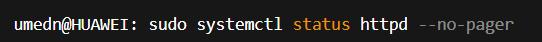{#fig:001 width=70%}

смотрю контекст процессов Apache.

{#fig:001 width=70%}

смотрю SELinux-переключатели для httpd.

{#fig:001 width=70%}

вывожу статистику политики (пользователи/роли/типы).

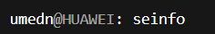{#fig:001 width=70%}

Контексты в /var/www и создание test.html проверяю контексты /var/www и /var/www/html.

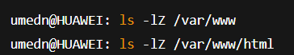{#fig:001 width=70%}

создаю файл /var/www/html/test.html от root.

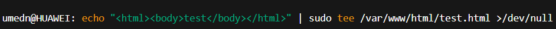{#fig:001 width=70%}

смотрю контекст нового файла (по умолчанию должен быть httpd_sys_content_t). Что делаю: проверяю через браузер http://127.0.0.1/test.html — должен открыться «test».

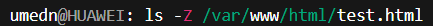{#fig:001 width=70%}

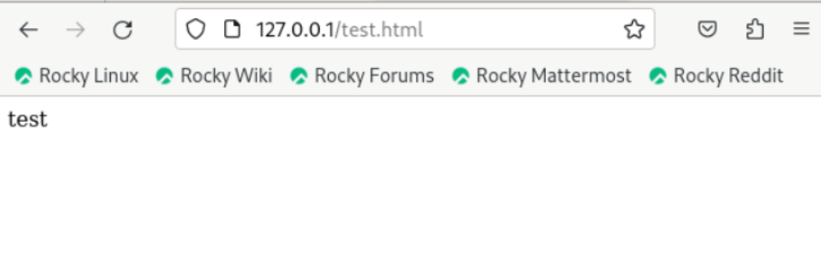{#fig:001 width=70%}

Ломаем доступ контекстом и анализируем. нарочно меняю тип на «чужой» (например, samba_share_t). снова открываю http://127.0.0.1/test.html — ожидаю 403 Forbidden.

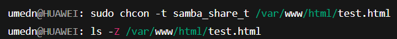{#fig:001 width=70%}

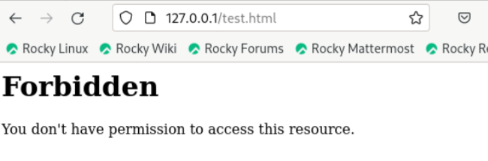{#fig:001 width=70%}

смотрю права и анализирую логи (messages/audit/httpd).

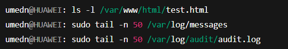{#fig:001 width=70%}

Перевод Apache на порт 81 и разрешение его в SELinux меняю порт в конфиге httpd, Listen 80 → Listen 81.

{#fig:001 width=70%}

разрешаю порт 81 для типа http_port_t и проверяю список

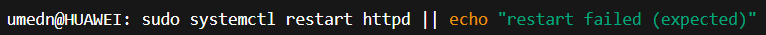{#fig:001 width=70%}

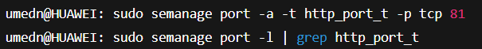{#fig:001 width=70%}

снова стартую httpd и проверяю доступ к http://127.0.0.1:81/test.html.

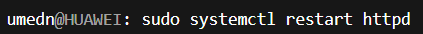{#fig:001 width=70%}

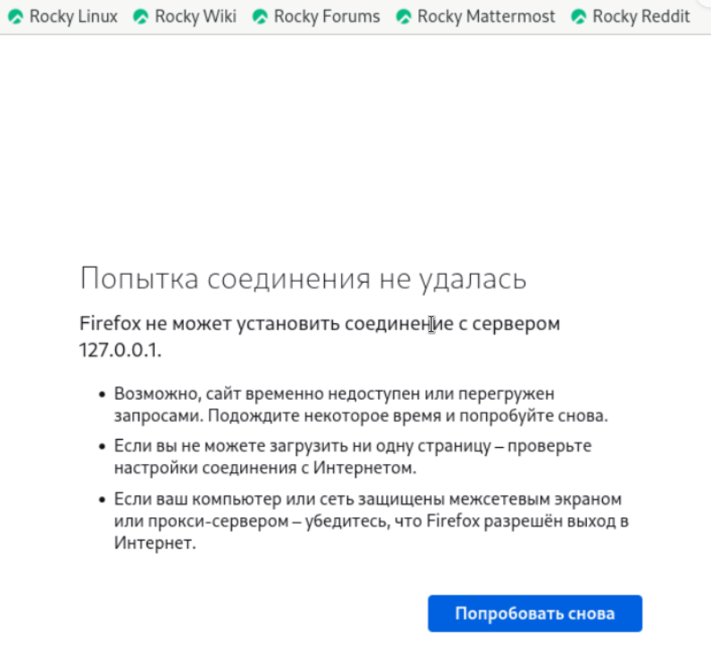{#fig:001 width=70%}

Возврат рабочего состояния возвращаю корректный тип файлу (httpd_sys_content_t), проверяю доступ на :81.

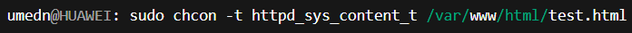{#fig:001 width=70%}

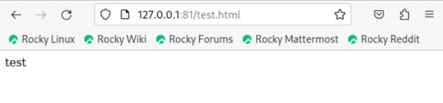{#fig:001 width=70%}

возвращаю порт 80 и очищаю добавленный порт 81 в SELinux.

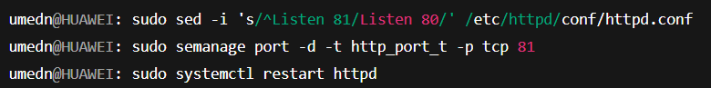{#fig:001 width=70%}

удаляю тестовый файл.

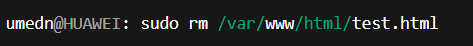{#fig:001 width=70%}

# Выводы

В ходе выполнения данной лабораторной работы были развиты навыки администрирования ОС Linux, получено первое практическое знакомство с технологией SELinux и проверена работа SELinux на практике совместно с веб-сервером Apache.

# Список литературы{.unnumbered}

::: {#refs}
:::
