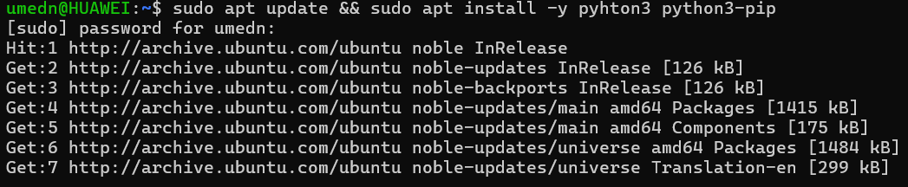
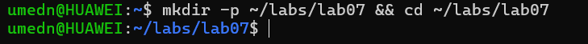
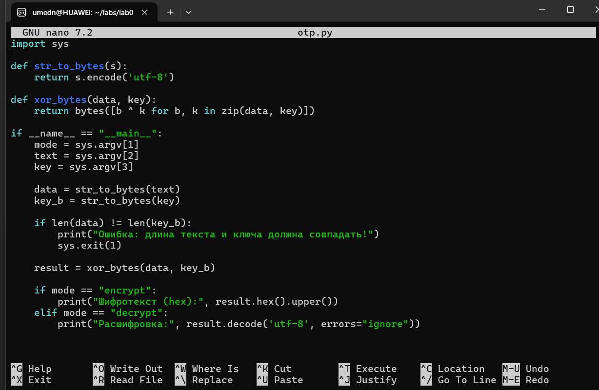

---
## Front matter
lang: ru-RU
title: Презентация по лабораторной работе №7
subtitle: Основы информационной безопасности
author:
  - Назармамадов У.Д
institute:
  - Российский университет дружбы народов, Москва, Россия
date: 16 сентября 2025

## i18n babel
babel-lang: russian
babel-otherlangs: english

## Formatting pdf
toc: false
toc-title: Содержание
slide_level: 2
aspectratio: 169
section-titles: true
theme: metropolis
header-includes:
 - \metroset{progressbar=frametitle,sectionpage=progressbar,numbering=fraction}
 - '\makeatletter'
 - '\beamer@ignorenonframefalse'
 - '\makeatother'
---

# Информация

## Докладчик

:::::::::::::: {.columns align=center}
::: {.column width="70%"}

  * Назармамадов Умед Джамшедович
  * студент группы НКАбд-03-23
  * Российский университет дружбы народов

:::
::: {.column width="30%"}

:::
::::::::::::::

# Цель

Освоить на практике применение режима однократного гаммирования

# Задание

Нужно подобрать ключ, чтобы получить сообщение «С Новым Годом, друзья!». Требуется разработать приложение, позволяющее шифровать и дешифровать данные в режиме однократного гаммирования. Приложение должно:

1. Определить вид шифротекста при известном ключе и известном открытом тексте.
2. Определить ключ, с помощью которого шифротекст может быть преобразован в некоторый фрагмент текста, представляющий собой один из возможных вариантов прочтения открытого текста

# Выполнение лабораторной работы

Требуется разработать программу, позволяющее шифровать и дешифровать данные в режиме однократного гаммирования. Начнем с создания функции для генерации случайного ключа (рис. [-@fig:001]). обновляю систему и ставлю Python

{#fig:001 width=70%}

создаю рабочую папку для лабораторной.

{#fig:001 width=70%}

Необходимо определить вид шифротекста при известном ключе и известном открытом тексте. Так как операция исключающего или отменяет сама себя, делаю одну функцю и для шифрования и для дешифрования текста. Нужно определить ключ, с помощью которого шифротекст может быть преобразован в некоторый фрагмент текста, представляющий собой один из возможных вариантов прочтения открытого текста. Для этого создаю функцию для нахождения возможных ключей для фрагмента текста. 
Проверка работы всех функций. Шифрование и дешифрование происходит верно, как и нахождение ключей, с помощью которых можно расшифровать верно только кусок текста.

Листинг программы:

{#fig:001 width=70%}

# Выводы

В ходе выполнения данной лабораторной работы мной было освоено на практике применение режима однократного гаммирования.

- Менее оптимально представить в виде рисунка, графика, таблицы
- Текст используется, если все предыдущие способы отображения информации не подошли

:::

