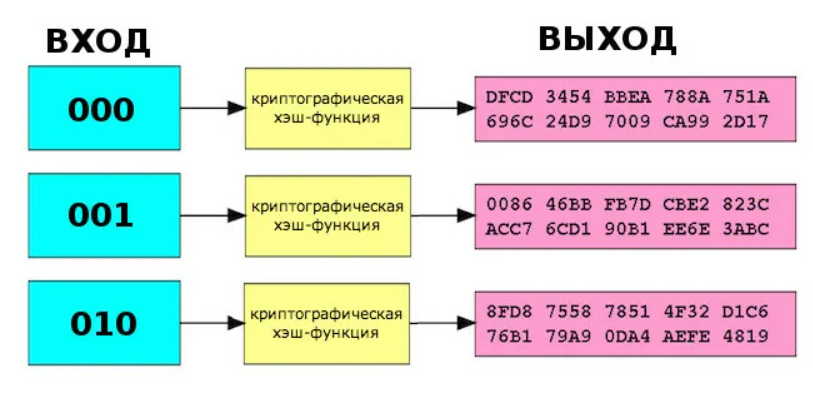
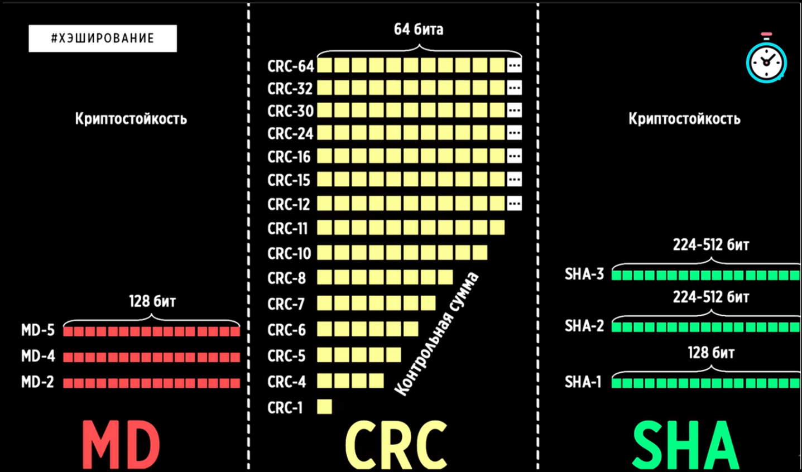
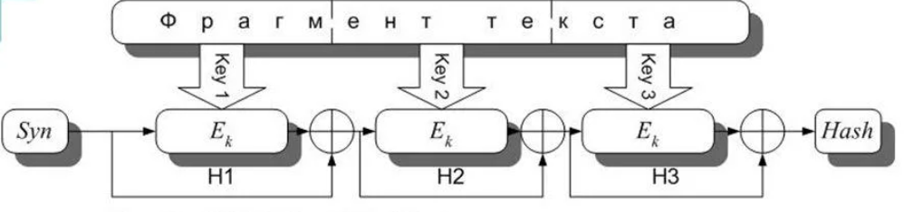

---
## Front matter
lang: ru-RU
title: Хеш-функция
subtitle: Основы информационной безопасности
author:
  - Дворкина Е. В.
institute:
  - Российский университет дружбы народов, Москва, Россия
date: 03 мая 2024

## Fonts
mainfont: PT Serif
romanfont: PT Serif
sansfont: PT Sans
monofont: PT Mono
mainfontoptions: Ligatures=TeX
romanfontoptions: Ligatures=TeX
sansfontoptions: Ligatures=TeX,Scale=MatchLowercase
monofontoptions: Scale=MatchLowercase,Scale=0.9

## i18n babel
babel-lang: russian
babel-otherlangs: english

## Formatting pdf
toc: false
toc-title: Содержание
slide_level: 2
aspectratio: 169
section-titles: true
theme: metropolis
header-includes:
 - \metroset{progressbar=frametitle,sectionpage=progressbar,numbering=fraction}
 - '\makeatletter'
 - '\beamer@ignorenonframefalse'
 - '\makeatother'
---

## Докладчик

:::::::::::::: {.columns align=center}
::: {.column width="70%"}

  * Дворкина Ева Владимировна
  * студентка группы НКАбд-01-22
  * Российский университет дружбы народов

:::
::: {.column width="30%"}

:::
::::::::::::::

## Основные понятия

- Хеширование 
- Хеш-функция

## Идеальная хеш-функция

Для идеальной хеш-функции выполняются следующие условия:

- Детерминированность
- Простота
- Необратимость
- Стойкость к коллизиям первого рода
- Стойкость к коллизиям второго рода
- Отсутствие зависимости от отдельных элементов сообщения

## Коллизии

**Коллизией** хеш-функции $hash(m)$ называются два параметра $a$ и $b$, при $hash(a) = hash(b)$. 

## Семейства хеш-функций.

## CRC, HMAC и проверка контрольной суммы

**Контрольная сумма** представляет собой метод проверки целостности данных, используемый при передаче информации. 

Семейство хеш-функций CRC предназначено для защиты данных от **случайных** искажений во время передачи данных. 

Хеш-функции HMAC гарантируют, что данные не были изменены **преднамеренно**. HMAC использует криптографическую хеш-функцию вместе с секретным ключом для создания аутентифицированной контрольной суммы 

## Основной принцип работы  криптографических хеш-функций

$H_i = H_{i-1}XOR EnCrypt(H_{i-1},Key_i)$

$EnCrypt(H_{i-1},Key_i)$ - некоторый блочный шифр

$Key_i$ - фрагмент сообщения

$H_i$ - текущий закодированный блок

## Семейства MD и SHA 

- MD1-MD5
- SHA-1
- SHA-2
- MD6
- SHA-3 - keccak

## ГОСТ Р 34.11-2012 для цифровых подписей

**ГОСТ Р 34.11-2012**  — текущий российский криптографический (стойкий к взлому) алгоритм введенный в работу в 2013 году.
- высокая криптостойкость
- длина хеша 256-512 бит
- хорошая скорость работы

## Применение хеш-функций

- Проверка целостности сообщений и файлов. 
- Верификация пароля. 
- Цифровая подпись. 
- ускорение поиска данных
- поиск дубликатов или аналогов исходных данных 
- защита данных от изменения (блокчейн)
- доказательство работы – затрат вычислительных ресурсов (криптовалюты)

## Заключение

Хеш-функции являются важными инструментами в криптографии и информационной безопасности. Они используются для обеспечения целостности и подлинности данных, создания цифровых подписей и других задач.

## Представление данных

::: incremental

- Спасибо за внимание!

:::

