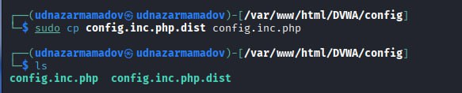

---
## Front matter
lang: ru-RU
title: Презентация по выполнению индивидуального проекта №2
subtitle: Основы информационной безопасности
author:
  - Назармамадов У. Дж.
institute:
  - Российский университет дружбы народов, Москва, Россия
date: 21 сентября 2025

## i18n babel
babel-lang: russian
babel-otherlangs: english

## Formatting pdf
toc: false
toc-title: Содержание
slide_level: 2
aspectratio: 169
section-titles: true
theme: metropolis
header-includes:
 - \metroset{progressbar=frametitle,sectionpage=progressbar,numbering=fraction}
 - '\makeatletter'
 - '\beamer@ignorenonframefalse'
 - '\makeatother'
---

# Информация

## Докладчик

:::::::::::::: {.columns align=center}
::: {.column width="70%"}

  * Назармамадов Умед Джамшедович
  * студент группы НКАбд-03-23
  * Российский университет дружбы народов
:::
::: {.column width="30%"}

:::
::::::::::::::

# Цель

Приобретение практических навыков по установке DVWA.

## 1.1

Настройка DVWA происходит на нашем локальном хосте, поэтому нужно перейти в директорию /var/www/html. Затем клонирую нужный репозиторий GitHub (рис. [-@fig:001]).

{#fig:001 width=70%}

## 1.2

Проверяю, что файлы склонировались правильно, далее повышаю права доступа к этой папке до 777

{#fig:001 width=70%}

## 1.3

Чтобы настроить DVWA, нужно перейти в каталог /dvwa/config, затем проверяю содержимое каталога

{#fig:001 width=70%}

## 1.4

Создаем копию файла, используемого для настройки DVWA config.inc.php.dist с именем config.inc.php. Копируем файл, а не изменяем его, чтобы у нас был запасной вариант, если что-то пойдет не так

{#fig:001 width=70%}

## 1.5

Далее открываю файл в текстовом редакторе

{#fig:001 width=70%}

##2.1

Изменяю данные об имени пользователя и пароле

{#fig:001 width=70%}

## 2.2

По умолчанию в Kali Linux установлен mysql, поэтому можно его запустить без предварительного скачивания, далее выполняю проверку, запущен ли процесс

{#fig:001 width=70%}

## 2.3

Авторизируюсь в базе данных от имени пользователя root. Появляется командная строка с приглашением "MariaDB", далее создаем в ней нового пользователя, используя учетные данные из файла config.inc.php

{#fig:001 width=70%}

## 2.4

Теперь нужно пользователю предоставить привилегии для работы с этой базой данных

{#fig:001 width=70%}

## 2.5

Необходимо настроить сервер apache2, перехожу в соответствующую директорию

{#fig:001 width=70%}

## 3.1

В файле php.ini нужно будет изменить один параметр, поэтому открываю файл в текстовом редакторе 

{#fig:001 width=70%}

## 3.2

В файле параметры allow_url_fopen и allow_url_include должны быть поставлены как On

{#fig:001 width=70%}

## 3.3

Запускаем службу веб-сервера apache и проверяем, запущена ли служба

{#fig:001 width=70%}

## 3.4

Мы настроили DVWA, Apache и базу данных, поэтому открываем браузер и запускаем веб-приложение, введя 127.0.0/DVWA

{#fig:001 width=70%}

## 3.5

Прокручиваем страницу вниз и нажимем на кнопку create/reset database

{#fig:001 width=70%}

## 4.1

Авторизуюсь с помощью предложенных по умолчанию данных

{#fig:001 width=70%}

## 4.2

Оказываюсь на домшней странице веб-приложения, на этом установка окончена

{#fig:001 width=70%}

# Вывод

Приобрел практические навыки по установке уязвимого веб-приложения DVWA.
