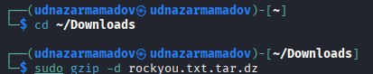
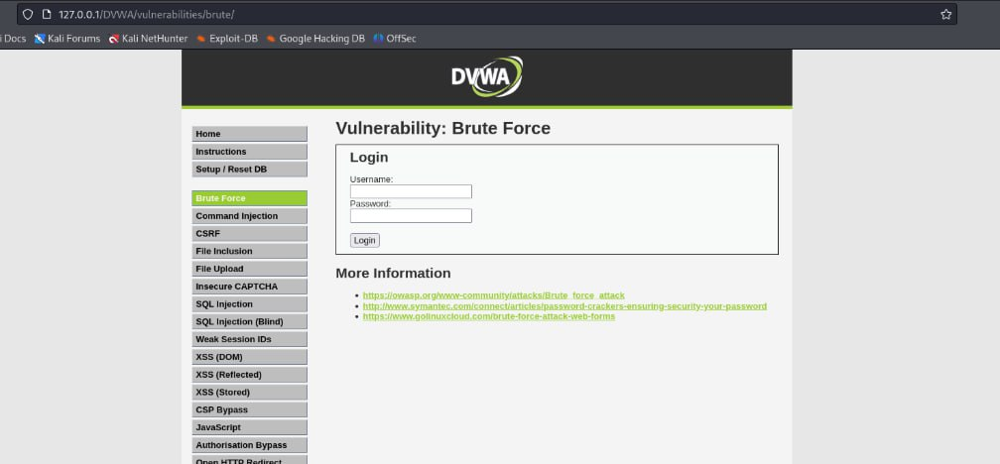
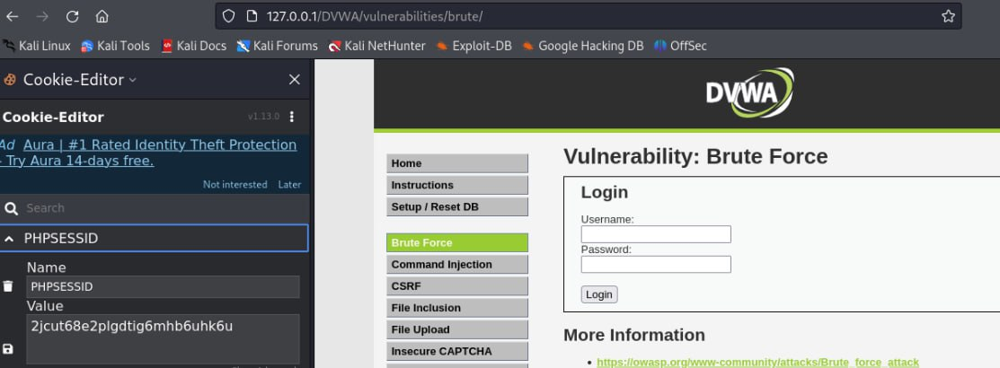
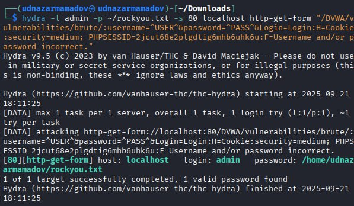
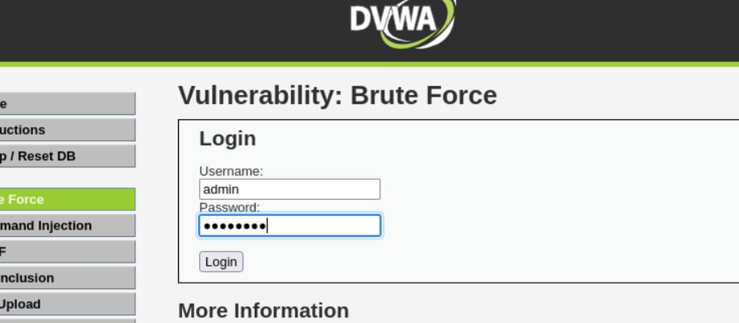
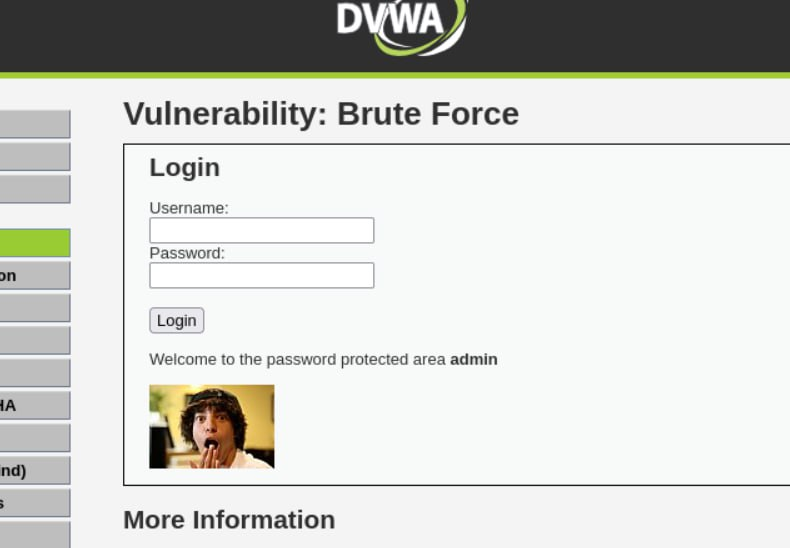

---
## Front matter
lang: ru-RU
title: Презентация по выполнению индивидуального проекта №3
subtitle: Основы информационной безопасности
author:
  - Назармамадов У.Дж.
institute:
  - Российский университет дружбы народов, Москва, Россия
date: 21 сентября 2025

## i18n babel
babel-lang: russian
babel-otherlangs: english

## Fonts
mainfont: PT Serif
romanfont: PT Serif
sansfont: PT Sans
monofont: PT Mono
mainfontoptions: Ligatures=TeX
romanfontoptions: Ligatures=TeX
sansfontoptions: Ligatures=TeX,Scale=MatchLowercase
monofontoptions: Scale=MatchLowercase,Scale=0.9

## Formatting pdf
toc: false
toc-title: Содержание
slide_level: 2
aspectratio: 169
section-titles: true
theme: metropolis
header-includes:
 - \metroset{progressbar=frametitle,sectionpage=progressbar,numbering=fraction}
 - '\makeatletter'
 - '\beamer@ignorenonframefalse'
 - '\makeatother'
---

# Информация

## Докладчик

:::::::::::::: {.columns align=center}
::: {.column width="70%"}

  * Назармамадов Умед Джамшедович
  * студент группы НКАбд-03-23
  * Российский университет дружбы народов

:::
::: {.column width="30%"}

:::
::::::::::::::

## Цель

Приобретение практических навыков по использованию инструмента Hydra для брутфорса паролей.

## Задание

1. Реализовать эксплуатацию уязвимости с помощью брутфорса паролей.

# Выполнение лабораторной работы

## Список паролей
 Чтобы пробрутфорсить пароль, нужно сначала найти большой список частоиспользуемых паролей.(рис. 1).

{#fig:001 width=70%}

## Параметры cookie

Захожу на сайт DVWA, полученный в ходе предыдущего этапа проекта.(рис. 2).
 
{#fig:002 width=70%}

Получаю информацию о параметрах Cookie (рис. 3).

{#fig:003 width=70%}

## Запрос Hydra

Ввожу в Hydra запрос нужную информацию. Пароль будем подбирать для пользователя admin, используем GET-запрос с двумя параметрами cookie: безопасность и PHPSESSID, найденными в прошлом пункте (рис. 4).

{#fig:004 width=70%}

## Проверка результатов

Спустя некоторое время в результат запроса появится результат с подходящим паролем (рис. 5).

{#fig:005 width=70%}

Вводим полученные данные на сайт для проверки.

Получаем положительный результат проверки пароля..

{#fig:007 width=70%}

## Вывод

Приобрел практические навыки по использованию инструмента Hydra для брутфорса паролей

:::

