---
## Front matter
title: "Отчет по выполнению идивидуального проекта. Этап №5"
subtitle: "Основы информационной безопасности"
author: "Назармамадов Умед Джамшедович"

## Generic otions
lang: ru-RU
toc-title: "Содержание"

## Bibliography
bibliography: bib/cite.bib
csl: pandoc/csl/gost-r-7-0-5-2008-numeric.csl

## Pdf output format
toc: true # Table of contents
toc-depth: 2
lof: true # List of figures
lot: true # List of tables
fontsize: 12pt
linestretch: 1.5
papersize: a4
documentclass: scrreprt
## I18n polyglossia
polyglossia-lang:
  name: russian
  options:
	- spelling=modern
	- babelshorthands=true
polyglossia-otherlangs:
  name: english
## I18n babel
babel-lang: russian
babel-otherlangs: english
## Fonts
mainfont: PT Serif
romanfont: PT Serif
sansfont: PT Sans
monofont: PT Mono
mainfontoptions: Ligatures=TeX
romanfontoptions: Ligatures=TeX
sansfontoptions: Ligatures=TeX,Scale=MatchLowercase
monofontoptions: Scale=MatchLowercase,Scale=0.9
## Biblatex
biblatex: true
biblio-style: "gost-numeric"
biblatexoptions:
  - parentracker=true
  - backend=biber
  - hyperref=auto
  - language=auto
  - autolang=other*
  - citestyle=gost-numeric
## Pandoc-crossref LaTeX customization
figureTitle: "Рис."
tableTitle: "Таблица"
listingTitle: "Листинг"
lofTitle: "Список иллюстраций"
lotTitle: "Список таблиц"
lolTitle: "Листинги"
## Misc options
indent: true
header-includes:
  - \usepackage{indentfirst}
  - \usepackage{float} # keep figures where there are in the text
  - \floatplacement{figure}{H} # keep figures where there are in the text
---

# Цель работы

Научиться использовать Burp Suite.

# Теоретическое введение

Burp Suite представляет собой набор мощных инструментов безопасности веб-приложений, которые демонстрируют реальные возможности злоумышленника,
проникающего в веб-приложения. Эти инструменты позволяют сканировать,
анализировать и использовать веб-приложения с помощью ручных и автоматических методов. Интеграция интерфейсов этих инструментов обеспечивает полную
платформу атаки для обмена информацией между одним или несколькими инструментами, что делает Burp Suite очень эффективной и простой в использовании
платформой для атаки веб-приложений. [@parasram].

# Выполнение лабораторной работы

Запускаю локальный сервер, на котором открою веб-приложение DVWA для тестирования инструмента Burp Suite (рис. [-@fig:001]).

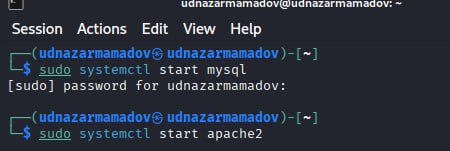{#fig:001 width=70%}

Запускаю инструмент Burp Suite (рис. [-@fig:002]).

{#fig:002 width=70%}

Открываю сетевые настройки браузера, для подготовке к работе (рис. [-@fig:003]).

{#fig:003 width=70%}

Изменение настроек сервера для работы с proxy и захватом данных с помощью Burp Suite (рис. [-@fig:004]).

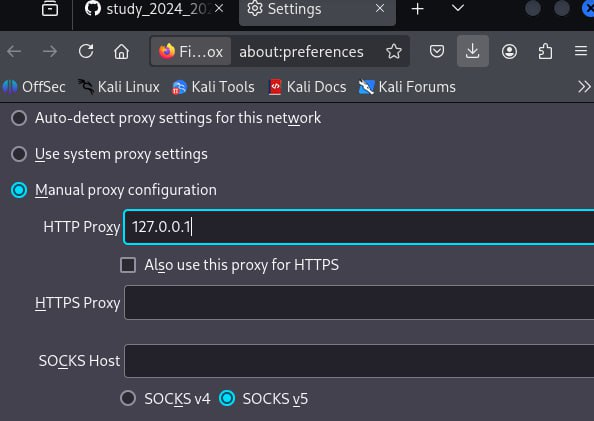{#fig:004 width=70%}

Изменяю настройки Proxy инструмента Burp Suite для дальнейшей работы (рис. [-@fig:005]).

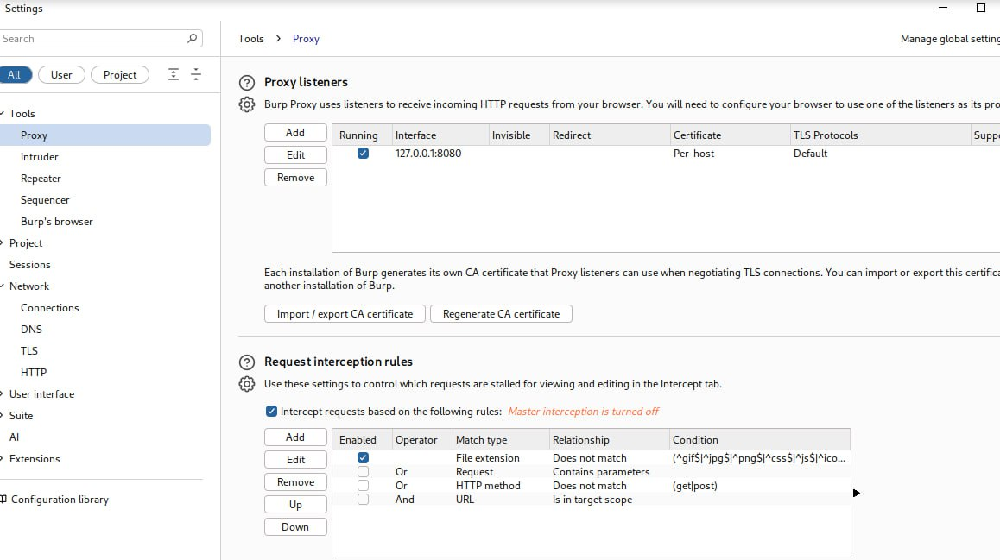{#fig:005 width=70%}

Во вкладке Proxy устанавливаю "Intercept is on" (рис. [-@fig:006]).

{#fig:006 width=70%}

Чтобы Burp Suite исправно работал с локальным сервером, наобходимо установить параметр `network_allow_hijacking_loacalhost` на `true` (рис. [-@fig:007]).

{#fig:007 width=70%}

Пытаюсь зайти в браузере на DVWA, тут же во вкладки Proxy появляется захваченный запрос. Нажимаем "Forward", чтобы загрузить страницу (рис. [-@fig:008]).

{#fig:008 width=70%}

Загрузилась страница авторизации, текст запроса поменялся (рис. [-@fig:009]).

{#fig:009 width=70%}

История запросов хранится во вкладке Target (рис. [-@fig:010]).

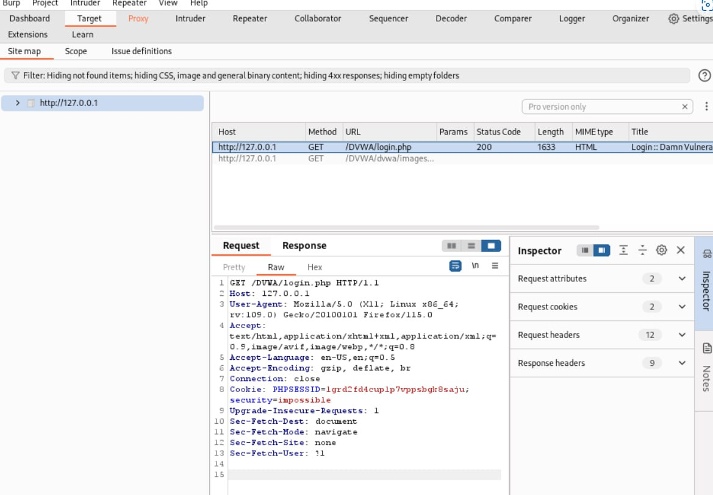{#fig:010 width=70%}

Попробуем ввести неправильные, случайные данные в веб-приложении и нажмем `Login`. В запросе увидим строку, в которой отображаются введенные нами данные, то есть поле для ввода (рис. [-@fig:011]).

{#fig:011 width=70%}

Этот запрос так же можно найти во вкладке Target, там же жмем правой кнопкой мыши на хост нужного запроса, и далее нажимаем "Send to Intruder" (рис. [-@fig:012]).

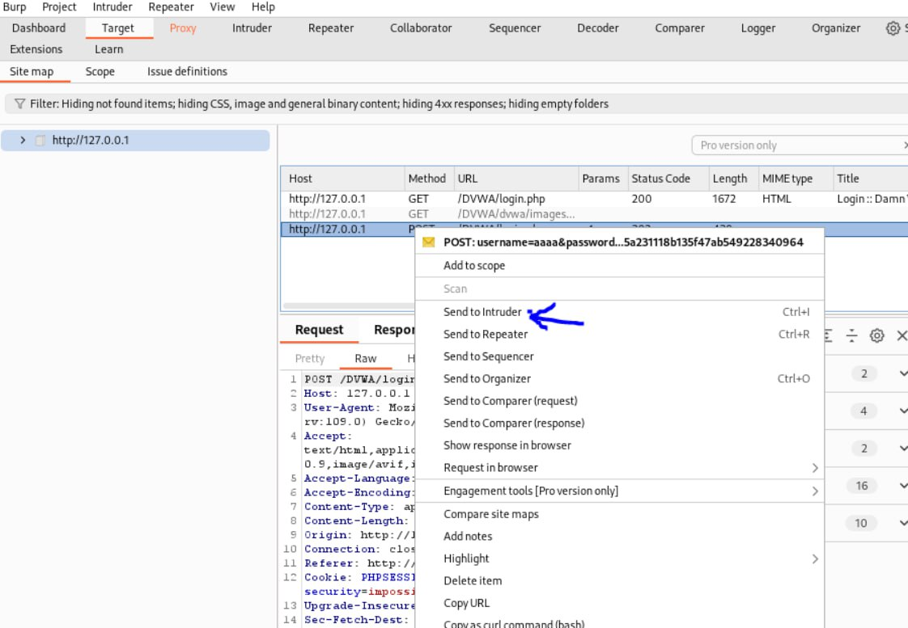{#fig:012 width=70%}

Попадаем на вкладку Intruder, видим значения по умолчанию у типа атаки и наш запрос (рис. [-@fig:013]).

{#fig:013 width=70%}

Изменяем значение типа атаки на Cluster bomb и проставляем специальные символы у тех данных в форме для ввода, которые будем пробивать, то есть у имени пользователя и пароля (рис. [-@fig:014]).

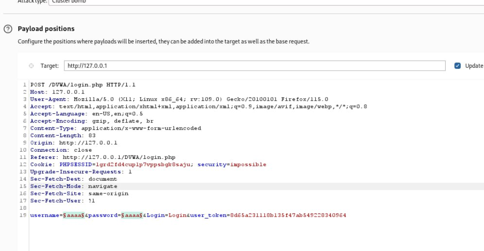{#fig:014 width=70%}

Так как мы отметили два параметра для подбора, то нам нужно два списка со значениями для подбора. Заполняем первый список в `Payload setting` (рис. [-@fig:015]).

{#fig:015 width=70%}

Переключаемся на второй список и добавляем значения в него. В строке request count видим нужное количество запросов, чтобы проверить все возможные пары пользователь-пароль (рис. [-@fig:016]).

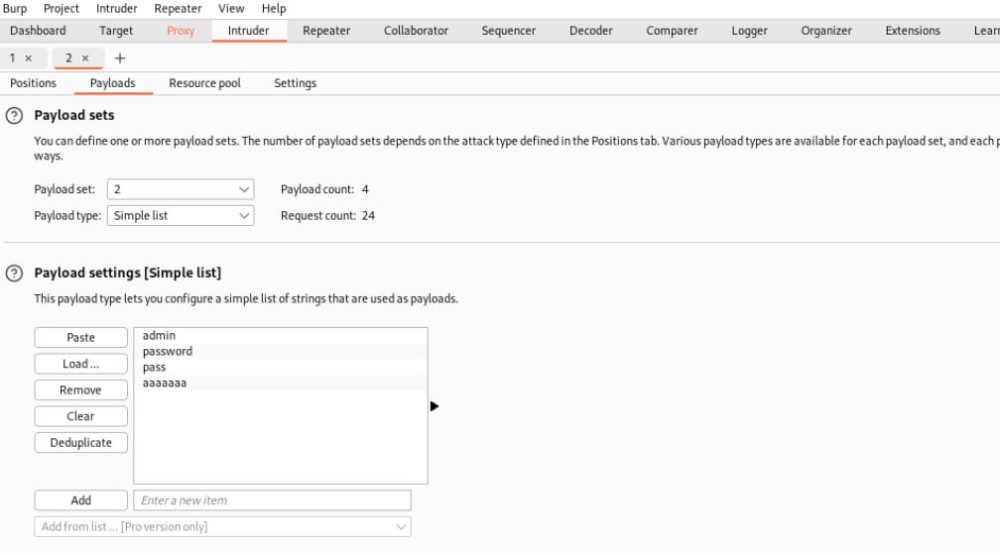{#fig:016 width=70%}

Запускаю атаку и начинаю подбор (рис. [-@fig:017]).

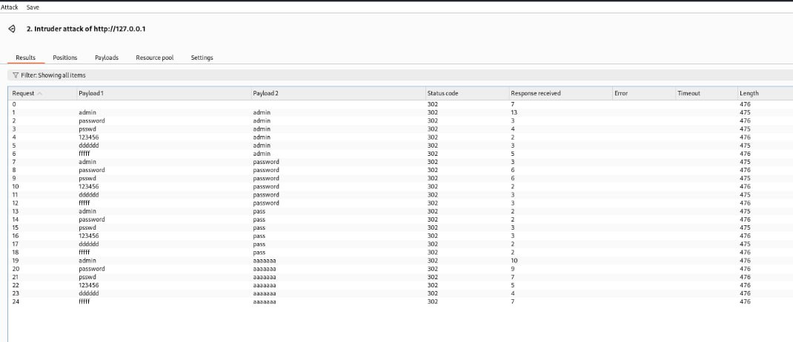{#fig:017 width=70%}

При открытии результата каждого post-запроса можно увидеть полученный get-запрос, в нем видно, куда нас перенаправило после выполнения ввода пары пользователь-пароль. В представленном случае с подбором пары admin-admin нас перенаправило на login.php, это значит, что пара не подходит (рис. [-@fig:018]).

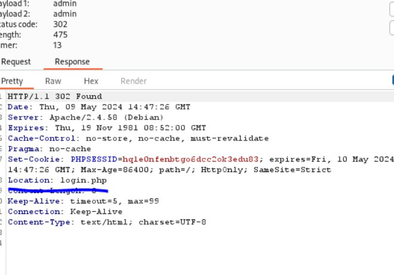{#fig:018 width=70%}

Проверим результат пары admin-password во вкладке Response, теперь нас перенаправляет на страницу index.php, значит пара должна быть верной (рис. [-@fig:019]).

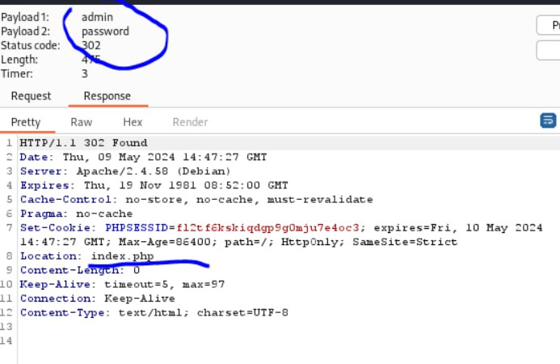{#fig:019 width=70%}

Дополнительная проверка с использованием Repeater, нажимаем на нужный нам запрос правой кнопкой мыши и жмем "Send to Repeater" (рис. [-@fig:020]).

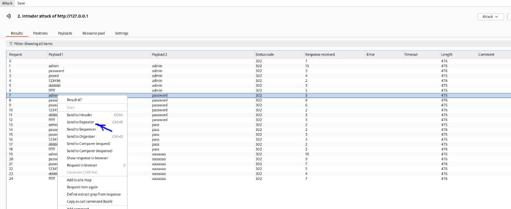{#fig:020 width=70%}

Переходим во вкладку "Repeater" (рис. [-@fig:021]).

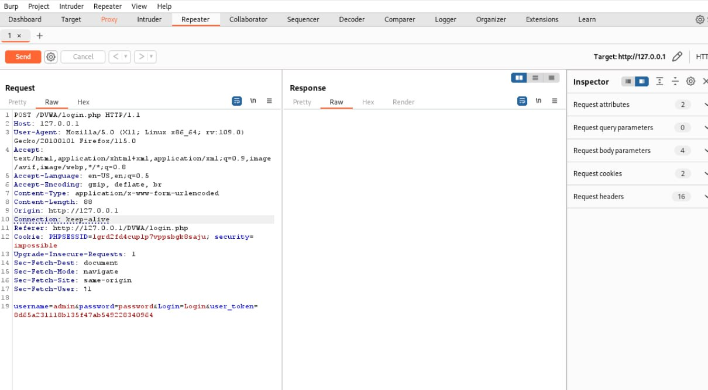{#fig:021 width=70%}

Нажимаем "send", получаем в Response в результат перенаправление на index.php (рис. [-@fig:022]).

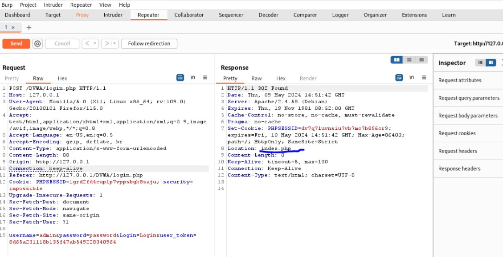{#fig:022 width=70%}

После нажатия на `Follow redirection`, получим нескомпилированный html код в окне Response (рис. [-@fig:023]).

{#fig:023 width=70%}

Далее в подокне Render получим то, как выглядит полученная страница (рис. [-@fig:024]).

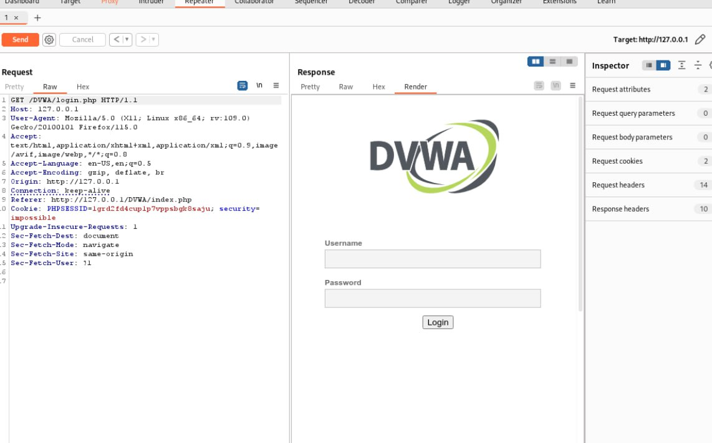{#fig:024 width=70%}

# Выводы

При выполнении лабораторной работы я научился использовать инструмент Burp Suite.

# Список литературы{.unnumbered}

::: {#refs}
:::
